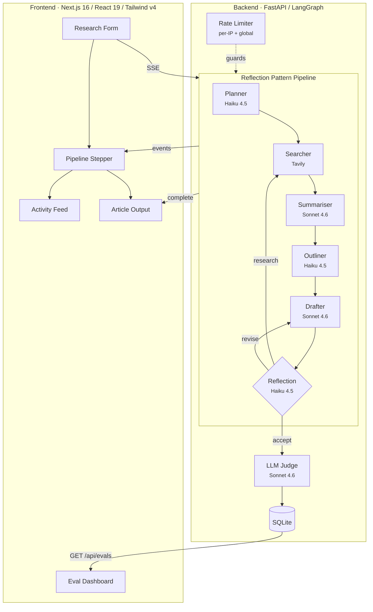
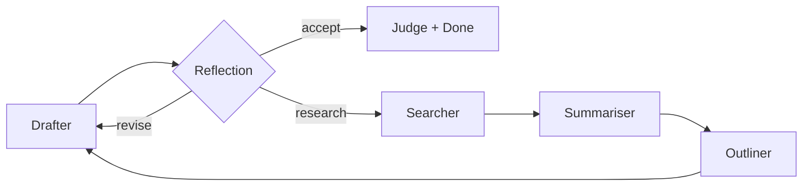
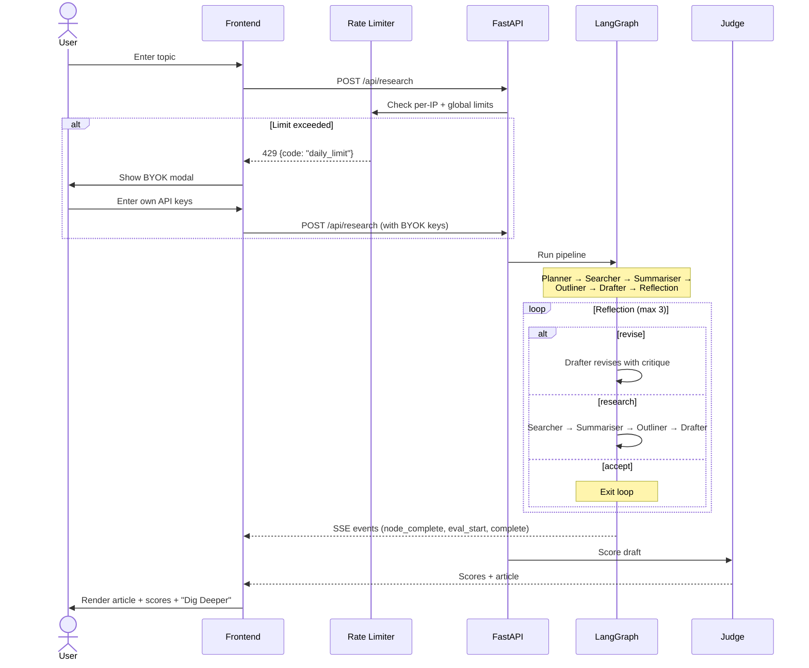
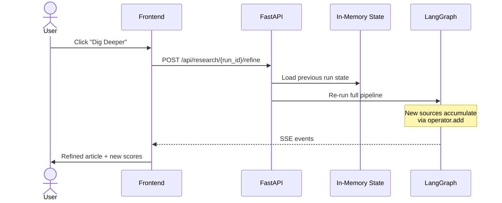
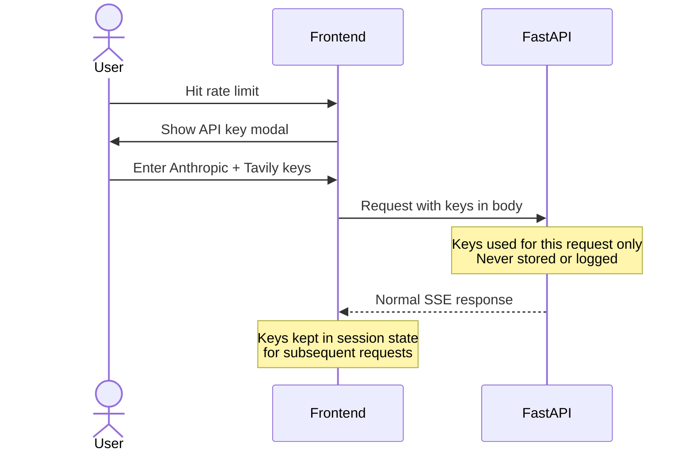
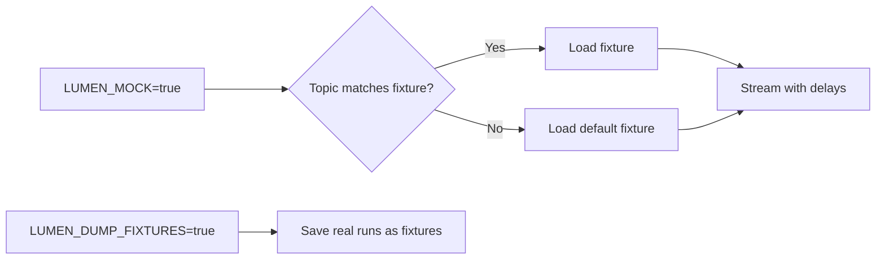

# Lumen

An AI research agent that searches the web, synthesises sources, and writes structured articles — with a self-improving reflection loop, real-time pipeline visibility, and LLM-as-judge evaluation.

Built to demonstrate how to architect a production-grade agentic system with observability, cost controls, and iterative refinement.

<!-- TODO: Replace with your own screenshot or GIF -->

<!-- Record a GIF with: research topic → pipeline stepper animating → reflection loop → article output with scores -->

## Architecture



### Pipeline Nodes

| Node | Model | What it does |
|------|-------|-------------|
| **Planner** | Haiku 4.5 | Generates targeted search queries from the topic |
| **Searcher** | Tavily API | Web search with URL deduplication across iterations |
| **Summariser** | Sonnet 4.6 | Batches all new sources into a single LLM call, extracts key facts |
| **Outliner** | Haiku 4.5 | Plans article structure with section headings and source assignments (first pass only) |
| **Drafter** | Sonnet 4.6 | Writes the article following the outline; on revisions, receives prior draft + accumulated critique |
| **Reflection** | Haiku 4.5 | Critiques draft on coverage, evidence, structure, accuracy. Routes to `accept`, `revise`, or `research` |
| **Judge** | Sonnet 4.6 | Scores the final draft on quality, relevance, groundedness (1-5) |

### Reflection Design Pattern

The reflection node is the core of the agentic loop. It evaluates the draft and decides what happens next:



- **`accept`** — Draft is strong. Proceed to scoring.
- **`revise`** — Writing quality issues (structure, clarity, argument strength). Loop back to drafter with critique. No wasted API calls on re-searching.
- **`research`** — Content gaps found. Loop back to searcher with targeted queries, then through the full pipeline.

Critique accumulates in `reflections[]` via `operator.add`. The drafter sees all prior feedback on each revision. The loop is capped at 3 iterations.

### State Accumulation

`search_results`, `summaries`, `summarised_urls`, and `reflections` use LangGraph's `operator.add` — each iteration appends, never overwrites. The summariser tracks processed URLs to avoid re-summarising sources from prior passes.

## Frontend

The frontend has three main views, designed so you can follow every step of the pipeline without scrolling or losing context.

### Horizontal Pipeline Stepper

A persistent stepper at the top shows all 6 nodes as dots with connecting lines. Nodes transition from pending (gray) → running (amber pulse) → complete (green check). On reflection loops, a "Pass 2 — Researching" header appears above the stepper with the reflection critique.

When the article is generated, the stepper collapses to compact mode (just the dots) to maximize space for the article.

### Activity Feed

During the pipeline run, the Activity tab shows a live feed of each node's output as it completes — search queries, source titles with URLs, outline sections, word counts, and reflection decisions. Entries are grouped by pass with clear headers.

After completion, switching to the Activity tab lets you review the full trace of what happened, including multi-pass reflection decisions and their critique text.

### Article / Activity Tabs

The content area has two tabs:
- **Activity** — active during the pipeline run, shows node-by-node progress with real data
- **Article** — auto-selected when the run completes, shows scores + article + sources

State is preserved in `sessionStorage` so navigating to the Eval Dashboard and back doesn't lose your article.

### Eval Dashboard

Navigate to `/evals` to view the last 50 scored runs. Each row shows quality, relevance, groundedness, latency, token count, and cost. Click **View** to open the full article with sources in a modal. Score trend charts visualise quality over time.

## Quality Scores

Every run is scored by an LLM-as-judge on three dimensions (1.0–5.0). Scores are persisted to SQLite alongside the article text and source URLs.

<!-- TODO: Replace with your actual scores after running 10-20 topics -->

### Sample Eval Results

| Topic | Quality | Relevance | Groundedness | Reflection Loops | Sources |
|-------|---------|-----------|--------------|-----------------|---------|
| AI agents in software development 2026 | 4.5 | 4.2 | 4.0 | 1 (research) | 8 |
| How does RAG work in production systems | 4.3 | 4.5 | 4.2 | 0 | 4 |
| Impact of LLMs on junior developer hiring | 4.1 | 4.0 | 3.8 | 1 (revise) | 4 |
| Edge computing and cloud architecture | 4.4 | 4.3 | 4.1 | 0 | 4 |
| Open source AI vs proprietary models | 4.2 | 4.4 | 4.0 | 1 (research) | 8 |

<!-- Run your own evals and update the table above with real data -->
<!-- Query: sqlite3 lumen_evals.db "SELECT topic, quality, relevance, groundedness FROM runs ORDER BY created_at DESC LIMIT 20" -->

**Key finding:** Runs that trigger a reflection loop consistently score higher on the dimension that triggered the loop. The reflection pattern measurably improves output quality.

## Workflows

### Research Flow



### Refinement Flow ("Dig Deeper")



### BYOK Flow (Bring Your Own Keys)



### Mock Mode



Zero API cost during development. Run `LUMEN_DUMP_FIXTURES=true` once with real keys to capture fixtures, then switch to `LUMEN_MOCK=true`.

## Rate Limiting & Cost Protection

This is a portfolio demo — rate limiting prevents bill surprises, not scale for production traffic.

### Limits

| Scope | Limit | Why |
|-------|-------|-----|
| Research per IP | 2/min, 10/hour, 20/day | Prevent single user from running up costs |
| Refine per IP | 3/min, 10/hour | Refines are cheaper but still cost tokens |
| Global daily cap | 100 runs/day (all users) | Hard ceiling on daily spend (~$10-15 worst case) |
| Concurrent pipelines | 1 per IP | Prevent parallel runs multiplying cost |
| Evals reads | 30/min per IP | Read-only, no API cost |

### What happens when limits are hit

| Limit | User experience |
|-------|----------------|
| Per-minute | "Too many requests. Please wait a moment." |
| Hourly/Daily | Modal prompts user to enter their own Anthropic + Tavily API keys |
| Global daily | Same modal — any user can continue with their own keys |
| Concurrent | "A pipeline is already running. Please wait." |

BYOK users bypass all per-IP and global limits. Keys are sent per-request, never stored on the server, and stripped from in-memory state after the run completes.

### Cost Controls

| Control | Impact |
|---------|--------|
| Haiku for planner, outliner, reflection | ~40% cost reduction vs all-Sonnet |
| Batched summariser (1 LLM call for all sources) | ~60% fewer summariser tokens |
| Source deduplication in searcher | No duplicate Tavily results across loops |
| Only summarise new sources on loops | No re-processing of prior iteration sources |
| Revision drafter skips old summaries | Old summaries are already in the draft |
| Disk cache (`LUMEN_DEV_CACHE=true`) | Zero API cost on repeated dev runs |
| Outliner runs first pass only | No redundant planning on revision loops |

## Tech Stack

| Layer | Technology |
|-------|-----------|
| Frontend | Next.js 16, React 19, TypeScript, Tailwind CSS v4 |
| UI | Framer Motion, Recharts, Zod v4, DM Sans/Mono |
| Backend | FastAPI, Python 3.11+, Uvicorn |
| Orchestration | LangGraph 1.1.3 |
| LLM | Claude Haiku 4.5 + Sonnet 4.6 (via LangChain-Anthropic) |
| Search | Tavily API |
| Storage | SQLite (aiosqlite) |
| Tracing | LangSmith (optional) |

## Tradeoffs

| Decision | Upside | Downside |
|----------|--------|----------|
| In-memory run state | No external store needed | Lost on restart; single-instance only |
| SQLite over Postgres | Zero-config, single file | No concurrent writes at scale |
| SSE over WebSocket | Simple, works through proxies | No client→server cancellation |
| Haiku for light nodes | 40% cost savings | Slightly less nuanced on edge cases |
| Disk cache by prompt hash | Zero cost on repeated runs | Manual invalidation; stale after model updates |
| Reflection loop (max 3) | Self-improving output | Up to 3x cost on worst case |
| Batched summariser | Fewer LLM calls | Parsing numbered output is fragile |
| In-memory rate limiter | Simple, no Redis dependency | Resets on server restart |
| sessionStorage for state | Research survives navigation | Lost when tab closes |

## Getting Started

### Prerequisites

- Python 3.11+
- Node.js 18+
- [pnpm](https://pnpm.io/)
- [Anthropic API key](https://console.anthropic.com/)
- [Tavily API key](https://tavily.com/)

### Backend

```bash
cd backend
python3 -m venv venv && source venv/bin/activate
pip install -r requirements.txt
cp ../.env.example .env  # add your API keys
python3 -m uvicorn main:app --reload --port 8000
```

### Frontend

```bash
cd frontend
pnpm install
pnpm dev
```

Open [http://localhost:3000](http://localhost:3000)

### Mock Mode (no API keys needed)

```bash
LUMEN_MOCK=true python3 -m uvicorn main:app --reload --port 8000
```

## Environment Variables

| Variable | Required | Description |
|---|---|---|
| `ANTHROPIC_API_KEY` | Yes | Claude API key |
| `TAVILY_API_KEY` | Yes | Tavily search API key |
| `LUMEN_MOCK` | No | Use pre-recorded fixtures (default: `false`) |
| `LUMEN_DEV_CACHE` | No | Disk cache for LLM/Tavily calls (default: `true`) |
| `LUMEN_DUMP_FIXTURES` | No | Save real runs as fixture files (default: `false`) |
| `LUMEN_DAILY_CAP` | No | Global daily research run limit (default: `100`) |
| `CORS_ORIGINS` | No | Allowed origins (default: `http://localhost:3000`) |
| `LANGSMITH_API_KEY` | No | LangSmith tracing key |
| `LANGSMITH_TRACING` | No | Enable tracing (`true`/`false`) |

## Guardrails

- **Input validation** — 3-500 character topics with prompt injection pattern blocking
- **Rate limiting** — Multi-tier per-IP (minute/hour/day) + global daily cap + concurrency limit
- **BYOK security** — User keys are per-request, never logged or persisted, stripped from state after runs
- **SSE validation** — All streaming events validated with Zod discriminated union schemas
- **Source deduplication** — Prevents duplicate URLs across search iterations
- **Cost controls** — Model split, batching, caching, iteration caps
- **Article persistence** — Draft text and source URLs saved to SQLite alongside eval scores

## Next Phase

- **Model-agnostic provider layer** — Abstract LLM calls behind a provider interface so users can switch between Claude, GPT-4, Gemini, or local models via config. The graph and prompt structure are already model-independent.
- **User accounts + research library** — OAuth with persistent storage (Postgres/Supabase) to save research history, revisit past articles, and track quality trends per user.
- **Directed refinement** — Replace "Dig Deeper" with a natural language input: "add more data on market size" or "make the tone more technical". Feed user instructions directly into the reflection→drafter loop.
- **Multi-agent research** — Spawn parallel searcher→summariser subgraphs for different angles of a topic, then merge summaries before drafting. Trades latency for depth.
- **Export and publish** — PDF/DOCX export, Notion API integration, and direct-to-blog publishing via CMS webhooks.
- **Eval regression CI** — Run a fixed set of topics on every prompt change, compare scores against baseline, and block deploys that regress quality.
