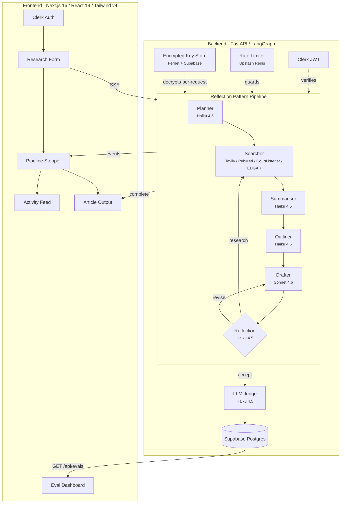
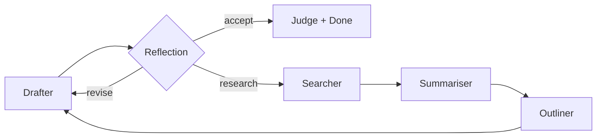
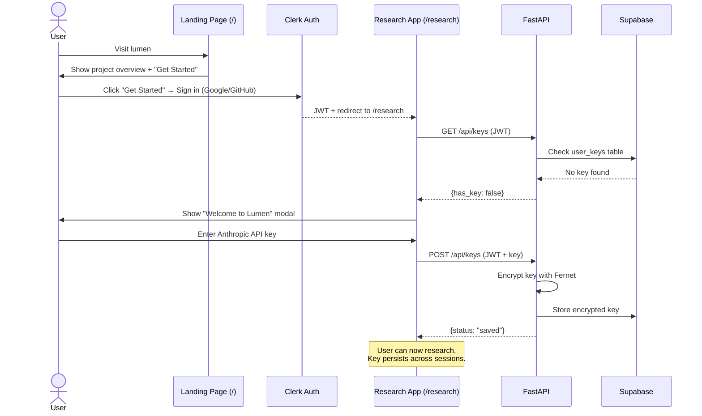
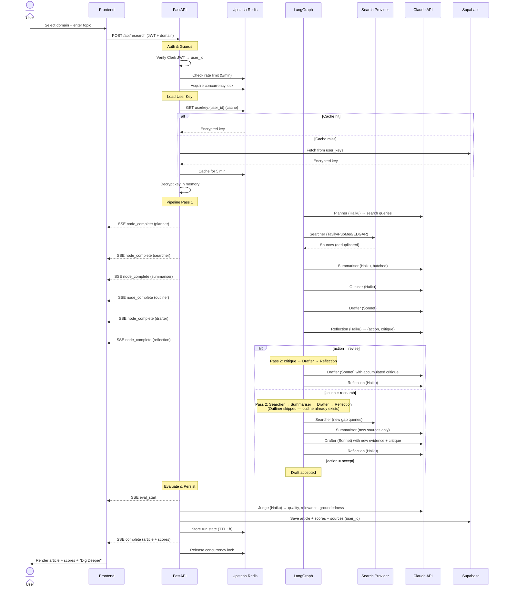
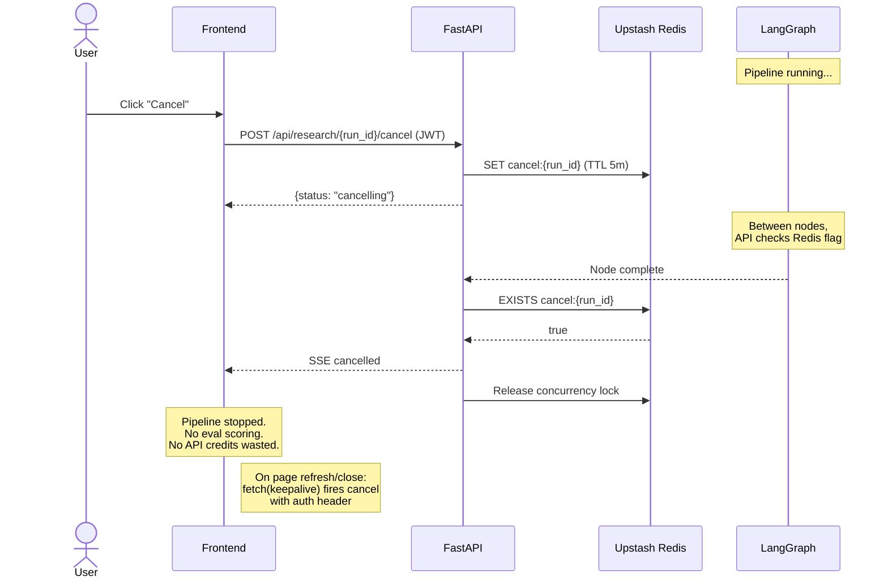
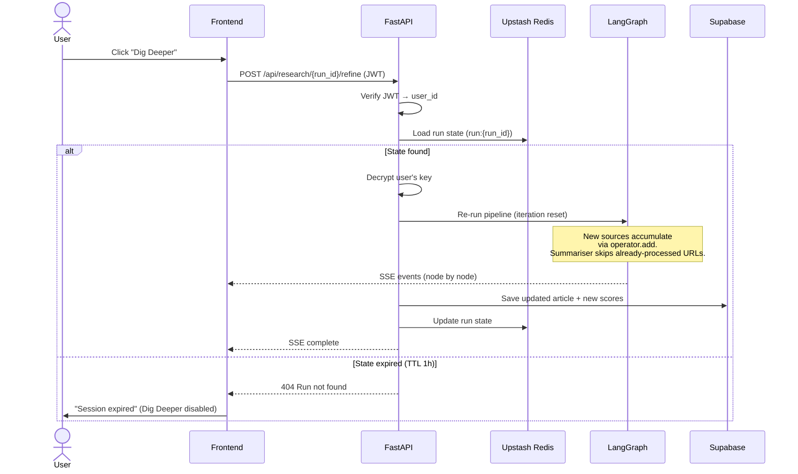
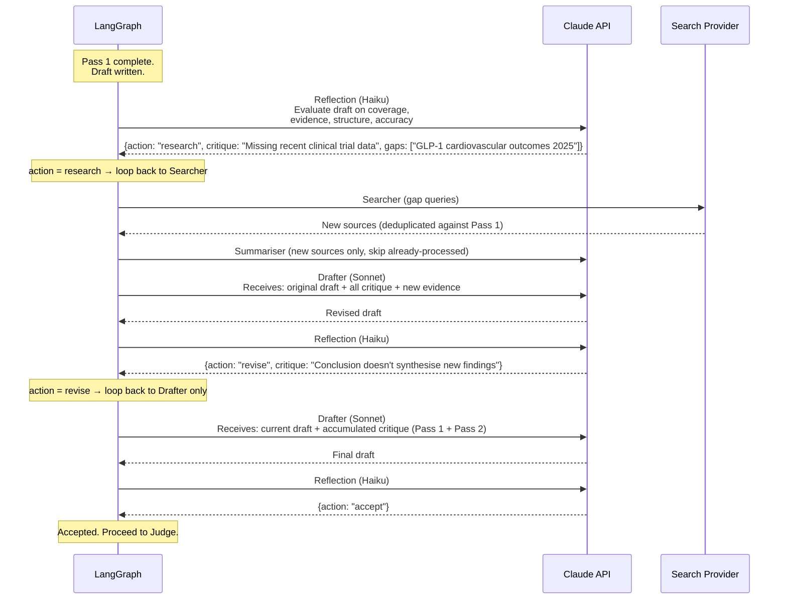

# Lumen

An AI research agent that searches the web, synthesises sources, and writes structured articles — with a self-improving reflection loop, real-time pipeline visibility, and LLM-as-judge evaluation.

## Architecture



The system has two main pieces: a Next.js frontend that handles auth and renders pipeline progress in real-time, and a FastAPI backend that orchestrates a LangGraph pipeline, streams SSE events, and persists results to Supabase.

The backend is stateless by design — all state lives in Upstash Redis (run state, rate limits, concurrency locks) and Supabase Postgres (articles, scores, encrypted keys). This means you can scale horizontally by adding more backend instances behind a load balancer; they share the same Redis state and database without coordination.

## Pipeline Design

### Pipeline Nodes

| Node | Model | What it does |
|------|-------|-------------|
| **Planner** | Haiku 4.5 | Generates targeted search queries from the topic |
| **Searcher** | Tavily / PubMed / CourtListener / SEC EDGAR | Domain-specific web search with URL deduplication across iterations |
| **Summariser** | Haiku 4.5 | Batches all new sources into a single LLM call, extracts key facts |
| **Outliner** | Haiku 4.5 | Plans article structure with section headings and source assignments (first pass only) |
| **Drafter** | Sonnet 4.6 | Writes the article following the outline; on revisions, receives prior draft + accumulated critique |
| **Reflection** | Haiku 4.5 | Critiques draft on coverage, evidence, structure, accuracy. Routes to `accept`, `revise`, or `research` |

### Reflection Design Pattern

The reflection node is the core of the agentic loop:



Without it, the pipeline is a one-shot generator. With it, the system self-corrects:

- **`accept`** — Draft meets the bar. Proceed to scoring.
- **`revise`** — Writing quality issues. Loop back to the drafter with critique. No wasted API calls on re-searching.
- **`research`** — Content gaps found. Loop back to the searcher with targeted queries, then through the full pipeline again.

Critique accumulates in `reflections[]` via LangGraph's `operator.add`. The drafter sees all prior feedback on each revision. The loop is capped at 3 iterations — this bounds worst-case cost at ~3x while giving the system enough room to meaningfully improve.

### State Accumulation

`search_results`, `summaries`, `summarised_urls`, and `reflections` all use `operator.add` — each iteration appends, never overwrites. The summariser tracks processed URLs to skip sources it already extracted from in prior passes. This matters because without it, a `research` loop would re-summarise everything from iteration 1, wasting tokens and adding redundant context to the drafter.

### Post-Pipeline Evaluation

After the pipeline completes, the draft is scored by an LLM-as-judge (Haiku 4.5) on quality, relevance, and groundedness (1-5). Scores are persisted to Supabase alongside the article and source URLs, linked to the authenticated user.

This gives us a built-in regression signal. If a prompt change degrades output quality, the eval dashboard shows it immediately across runs.

## Model Split Strategy

Only the Drafter uses Claude Sonnet 4.6. Every other node — including the judge — runs on Claude Haiku 4.5. The reasoning is straightforward: the drafter is the only node where model quality directly affects user-facing output. Every other node produces structured, constrained output where Haiku performs well. This split cuts cost by ~75% compared to running Sonnet everywhere.

| Node | Model | Why |
|------|-------|-----|
| **Planner** | Haiku 4.5 | Outputs a JSON array of search queries. Structured, constrained. |
| **Summariser** | Haiku 4.5 | Fact extraction, not creative writing. |
| **Outliner** | Haiku 4.5 | Bullet-point outline with source assignments. |
| **Drafter** | Sonnet 4.6 | The one node where model quality directly affects user-facing output — long-form writing, citations, professional tone. |
| **Reflection** | Haiku 4.5 | JSON classification (accept/revise/research) with critique text. |
| **Judge** | Haiku 4.5 | Outputs 3 numbers in JSON. |

**Cost per run:** ~$0.05 for a single-pass run with user's own API key. Worst case with 3 reflection iterations: ~$0.10-0.15.

## Domain-Specific Research

Four research domains, each with its own search provider and prompt context:

| Domain | Search Provider | Cost | What it searches |
|--------|----------------|------|-----------------|
| **General** | Tavily | Server key | General web — news, blogs, documentation |
| **Medical** | PubMed (NCBI) | Free | 36M+ biomedical papers, clinical trials, meta-analyses |
| **Legal** | CourtListener | Free | US federal/state court opinions, case law |
| **Financial** | SEC EDGAR | Free | Public company filings — 10-K, 10-Q, 8-K |

Each domain is a YAML config in `backend/domains/`. The config provides context appended to each node's prompt — query terminology, extraction focus, output template, and validation rules. Adding a new domain requires only a YAML file and no code changes.

The key design choice here: **the agentic pattern is domain-agnostic; the context layer is domain-specific.** The pipeline graph, reflection logic, and streaming infrastructure don't change between domains. Only the prompts and search provider differ. This means you could add a "Climate Science" domain by writing a YAML file that points to a climate-focused search API and provides domain-specific prompt context — without touching the pipeline code.

PubMed, CourtListener, and SEC EDGAR are free government/nonprofit APIs that require no keys. Tavily (General domain) uses the server's key.

## Handling Context Failure

The hardest problem in agentic systems isn't the model — it's context. An agent that guesses wrong at scale destroys user trust. Each layer in the pipeline addresses a specific class of context failure:

| Layer | What it prevents |
|-------|-----------------|
| **Planner** | Multiple targeted queries reduce the chance of missing an angle |
| **Searcher** | URL deduplication prevents one source from inflating its weight |
| **Summariser** | Batched extraction lets the model see all sources together and identify contradictions |
| **Outliner** | Maps sources to sections — the drafter doesn't guess which evidence supports which claim |
| **Reflection** | Catches gaps, unsupported claims, and structural issues before delivery |
| **Judge** | Makes quality visible — a low groundedness score signals weak citations |

The reflection loop is the critical layer. Without it, the pipeline is a one-shot generator. With it, the system self-corrects through up to 3 iterations of targeted revision or research.

## Authentication & Key Management

### Sign-in

Users authenticate via Clerk (Google/GitHub OAuth). All API endpoints require a valid JWT, verified on the backend by fetching Clerk's JWKS (cached for 1 hour) and validating the issuer claim against a pinned URL — not the unverified `iss` claim from the token itself, which would be an SSRF vector.

### BYOK (Bring Your Own Key)

On first sign-in, users are prompted to enter their Anthropic API key. The key lifecycle:

1. **Encrypted** with Fernet (AES-128-CBC) using a server-side encryption key
2. **Stored** in Supabase `user_keys` table (only the ciphertext)
3. **Cached** in Upstash Redis for 5 minutes (encrypted form only) to avoid hitting Supabase on every request
4. **Decrypted** per-request in memory, used for the LLM call, then discarded
5. **Stripped** from pipeline state before any persistence to Redis or Supabase

BYOK shifts the most expensive operational cost — LLM inference — to the user. The server never holds an Anthropic key of its own for production use. For search, three of the four domains use free government APIs (PubMed, CourtListener, SEC EDGAR), and General domain uses Tavily because it returns pre-extracted page content that the summariser can consume directly — alternatives like Brave or SearXNG return snippets only, which would require a content fetching and HTML parsing layer between the searcher and summariser. All infrastructure (auth, database, cache) runs on managed free tiers, keeping the operational cost near zero.

## Real-Time Streaming

The frontend receives pipeline progress via Server-Sent Events. Each node completion fires an SSE event with timing, iteration number, and node-specific metadata (search result previews, word counts, reflection decisions). This gives the user a live view of every step as it happens.

I chose SSE over WebSockets because the data flow is unidirectional (server → client), SSE reconnects automatically on network drops, and it works through standard HTTP infrastructure without upgrade negotiation. The one limitation is that you can't cancel a pipeline mid-node through SSE — cancellation is implemented as a Redis flag (`cancel:{run_id}`) that the backend checks between nodes.

For page-unload cancellation, the frontend sends a `fetch` request with `keepalive: true` and a cached auth token. This replaced an earlier `sendBeacon` approach that couldn't include Authorization headers, which meant the cancel endpoint (which requires auth) would always reject it.

### SSE Events

| Event | When | Payload |
|-------|------|---------|
| `start` | Pipeline begins | `{run_id, topic, domain}` |
| `node_complete` | A node finishes | `{node, timing_ms, iteration, meta, reflection_action?, critique?}` |
| `eval_start` | Scoring begins | `{}` |
| `complete` | Pipeline done | `{draft, sources, scores, node_timings, token_counts, run_id}` |
| `cancelled` | Pipeline stopped | `{run_id}` |
| `error` | Pipeline failed | `{code, detail}` — codes: `llm`, `search_provider`, `auth`, `database`, `unknown` |

## Caching

```
Request → L1 Local LRU (0ms) → L2 Redis (2ms) → LLM API (10-60s)
```

LLM responses are cached in two tiers. The local LRU (100 entries, per-process) handles repeated prompts with zero network calls. On L1 miss, Redis serves as a shared persistent cache across instances with 7-day TTL.

The cache is designed for development and shared-key scenarios — BYOK users bypass LLM caching entirely since each user's API key produces different billing context. For non-BYOK usage (server key), a fresh topic uses ~12 Redis commands (6 GET misses + 6 SET writes) and a repeated topic from the same server uses 0 — everything served from L1. The tradeoff: L1 is lost on restart, but that's by design — Redis is the durable layer, L1 is a hot-path optimiser.

Additional cost controls in the pipeline:
- Batched summariser (1 LLM call for all sources per iteration, not 1 per source)
- Source deduplication in the searcher — no duplicate URLs across loops
- Only summarise new sources on loops — skip URLs already processed
- Outliner runs first pass only — no redundant planning on revision loops

## Rate Limiting & Concurrency

With BYOK, rate limiting protects server resources, not LLM costs.

| Limit | Value | Why |
|-------|-------|-----|
| Per-user per-minute | 5 requests | Prevents scripted abuse |
| Concurrent pipelines | 1 per user | Each pipeline holds a long-running SSE connection and runs multiple LLM calls; allowing unlimited concurrency would exhaust server resources |
| Evals reads | 30/min per user | Read-only, lightweight |

BYOK users bypass per-user rate limits since they're paying for their own LLM calls — the limits exist to protect server resources, not to gate access. Concurrency limits still apply to everyone.

Rate limits use Redis sorted sets (sliding window) so they work across horizontally scaled instances. Concurrency is a simple Redis key with a 5-minute auto-expire safety net in case the release fails.

## Failure Modes

| Failure | Impact | Mitigation |
|---------|--------|------------|
| **Clerk down** | Users can't sign in; token refresh fails | Clerk JWTs expire in ~60 seconds. Existing sessions break quickly unless Clerk recovers. No local fallback. |
| **Supabase down** | Can't save articles or fetch evals; key lookup fails | Redis key cache serves keys for 5 min. Pipeline still runs — just can't persist results |
| **Upstash Redis down** | No rate limiting, no run state, no cache | Pipeline still runs (cache miss = direct LLM call). Rate limits fail-open. Dig Deeper won't work (no saved state) |
| **Claude API down** | Pipeline fails at first LLM node | SSE `error` event streamed to frontend. User's key is not charged for failed calls |
| **Domain search provider down** | That domain's search fails | SSE `error` event. Other domains unaffected — each has an independent provider |

The design principle: **fail-open on guards, fail-visible on data.** Rate limiting and caching fail silently (allow the request through). Data operations fail with a classified error — the backend categorises exceptions into error codes (`llm`, `search_provider`, `auth`, `database`, `unknown`) and the frontend maps each code to a user-friendly message with an actionable hint (e.g. "Search Provider Unavailable — try a different research domain").

## Frontend

### Routes

| Route | Auth | Description |
|-------|------|-------------|
| `/` | Public | Landing page — project overview, features, sign-in CTA |
| `/sign-in` | Public | Clerk sign-in (handles both sign-in and sign-up) |
| `/research` | Required | Research app — pipeline, activity feed, article output |
| `/evals` | Required | Eval dashboard — score history, article viewer |

Unauthenticated users visiting `/research` or `/evals` are redirected to Clerk's sign-in via Next.js middleware. The landing page shows what Lumen does before requiring auth — this is intentional so potential users can evaluate the product before committing to an account.

### Horizontal Pipeline Stepper

A persistent stepper shows all 6 nodes as dots with connecting lines. Nodes transition from pending → running → complete. On reflection loops, a "Pass 2" header appears with the reflection action and a tooltip showing the critique on hover. When the article is generated, the stepper collapses to compact mode.

### Activity Feed

Live feed of each node's output — search queries, source titles with URLs, outline sections, word counts, and reflection decisions rendered as markdown. Entries are grouped by pass.

### Article / Activity Tabs

- **Activity** — active during the pipeline run, shows node-by-node progress
- **Article** — auto-selected when the run completes, shows scores + article + sources

State is preserved in `sessionStorage` so navigating to the Eval Dashboard and back doesn't lose your article.

### Eval Dashboard

Shows the last 50 scored runs for the authenticated user. Click **View** to open the full article with sources in a modal. Score trend charts visualise quality over time. A regression banner appears when the latest run scores significantly lower than the previous one.

## Backend Module Structure

The backend is split into focused modules with single responsibilities:

| Module | Responsibility |
|--------|---------------|
| `main.py` | FastAPI app setup, request validation, endpoint handlers |
| `auth/clerk.py` | Clerk JWT verification with cached JWKS |
| `auth/keys.py` | Fernet encryption/decryption for user API keys |
| `redis_services.py` | Run state, cancellation flags, rate limiting, concurrency locks |
| `streaming.py` | SSE event formatting, pipeline orchestration |
| `agent/` | LangGraph pipeline — nodes, graph, prompts, search providers |
| `evals/` | LLM-as-judge scoring and Supabase persistence |
| `domains/` | YAML domain configs |

The pipeline is infrastructure-agnostic. Swapping Redis or Supabase requires changing `redis_services.py`, `evals/store.py`, and `auth/keys.py`. The agentic layer (`agent/`, `domains/`, `streaming.py`) is untouched.

## Testing

The backend has a 50-test suite covering all modules:

| Test file | Coverage |
|-----------|----------|
| `test_clerk.py` | JWT auth — valid token, expired, wrong issuer, missing claims |
| `test_redis_services.py` | Run state, cancellation, rate limiting, concurrency |
| `test_streaming.py` | SSE formatting, node events, stream lifecycle, cancellation, BYOK key resolution |
| `test_endpoints.py` | All HTTP endpoints — validation, auth, rate limits, CRUD |

Tests use a `FakeRedis` in-memory implementation and mock the LangGraph pipeline, so the suite runs in ~1 second with no external dependencies.

## Monitoring & Observability

| Layer | Tool | What it tracks |
|-------|------|---------------|
| **LLM traces** | LangSmith | Full LangGraph execution traces, token usage, latency per node |
| **Eval quality** | Built-in `/evals` dashboard | Quality/relevance/groundedness scores over time, regression detection |
| **API errors** | FastAPI → SSE `error` events | Pipeline errors streamed to frontend in real-time |
| **Infrastructure** | Supabase + Upstash dashboards | Database size, Redis command count |

## Infrastructure

All infrastructure runs on free tiers with no credit card required.

| Component | Service | Free tier |
|-----------|---------|-----------|
| **Auth** | Clerk | 10K MAU |
| **Database** | Supabase Postgres | 500MB |
| **L1 Cache** | In-memory LRU (per-process) | N/A — built-in |
| **L2 Cache & State** | Upstash Redis | 500K cmds/month |
| **Search** | PubMed, CourtListener, SEC EDGAR | Unlimited |
| **LLM** | User's own key (BYOK) | N/A |

## Deployment

```
Users → Vercel (Next.js) → Render (FastAPI) → Supabase + Upstash + Clerk
                                             → Claude API (user's key)
                                             → PubMed / CourtListener / EDGAR
                                             → LangSmith (traces)
```

| Component | Platform |
|-----------|----------|
| **Frontend** | Vercel |
| **Backend** | Render |
| **Database** | Supabase Postgres (managed) |
| **Cache & State** | Upstash Redis (managed) |
| **Auth** | Clerk (managed) |

All infrastructure runs on free tiers. The backend scales horizontally — add more Render instances and they share the same Redis state, rate limits, and database without coordination.

## Tradeoffs

| Decision | Upside | Downside |
|----------|--------|----------|
| Supabase Postgres | Persistent, per-user data, works across instances | External dependency |
| Upstash Redis | Survives restarts, native TTL, shared state across instances | Command limits on free tier |
| Clerk for auth | OAuth, JWT, zero auth code to maintain | Vendor lock-in |
| BYOK with encrypted storage | Zero operator LLM cost, keys encrypted at rest | Users must have an Anthropic API key |
| SSE + REST cancel | Simple unidirectional streaming, cancel between nodes | Can't cancel mid-node |
| Sonnet only for drafter | ~75% cost savings | Lighter model on extraction tasks |
| Two-tier cache (L1 local + L2 Redis) | L1 eliminates Redis calls on hot paths; L2 survives restarts | L1 lost on restart (by design) |
| Reflection loop (max 3) | Self-improving output | Up to 3x cost on worst case |
| YAML domain configs | No code changes to add domains | Requires server restart |

## Key Workflows

### 1. First-Time User Flow



### 2. Research Flow



### 3. Cancellation Flow



### 4. Refinement Flow ("Dig Deeper")




### 5. Reflection Loop (Detail)



This shows the three distinct paths in action: `research` triggers a full re-search with gap queries, `revise` sends only the drafter back with accumulated critique (no wasted search API calls), and `accept` exits the loop. Each pass appends to the shared state via `operator.add` — the drafter always sees the full history of critique and evidence, not just the latest iteration.

## Guardrails

- **Authentication** — Clerk OAuth with JWT verification on all API endpoints
- **Encrypted key storage** — User API keys encrypted with Fernet, cached in Redis (encrypted form), decrypted per-request only
- **Rate limiting** — 5/min per user + 1 concurrent pipeline via Upstash Redis
- **Input validation** — 3-500 character topics with prompt injection blocking
- **Pipeline cancellation** — Cancel button + `fetch(keepalive)` with auth on page unload; Redis flag checked between nodes
- **SSE validation** — Zod discriminated union schemas on all streaming events
- **Source deduplication** — No duplicate URLs across search iterations
- **Cost controls** — BYOK (zero operator LLM cost), Haiku for 5/6 nodes, batching, caching
- **Article persistence** — Draft, sources, and scores saved per user in Supabase
- **Domain isolation** — YAML configs, no code changes to add domains

## API Surface

All endpoints require a Clerk JWT in the `Authorization: Bearer <token>` header (except `/healthz` and `/api/domains`).

| Method | Endpoint | Auth | Description |
|--------|----------|------|-------------|
| `GET` | `/healthz` | No | Health check |
| `GET` | `/api/domains` | No | List available research domains |
| `POST` | `/api/research` | Yes | Start a research pipeline (SSE stream) |
| `POST` | `/api/research/{id}/refine` | Yes | Re-run pipeline on existing research (SSE stream) |
| `POST` | `/api/research/{id}/cancel` | Yes | Cancel a running pipeline |
| `GET` | `/api/research/{id}` | Yes | Fetch a saved article with scores |
| `GET` | `/api/evals` | Yes | List user's last 50 eval runs |
| `GET` | `/api/keys` | Yes | Check if user has a saved API key (preview only) |
| `POST` | `/api/keys` | Yes | Encrypt and save user's Anthropic API key |
| `DELETE` | `/api/keys` | Yes | Delete user's saved API key |

## Environment Variables

### Backend (`.env`)

| Variable | Required | Description |
|---|---|---|
| `CLERK_SECRET_KEY` | Yes | Clerk secret key for JWT verification |
| `CLERK_ISSUER_URL` | Yes | Clerk JWT issuer URL (e.g. `https://your-instance.clerk.accounts.dev`) |
| `ENCRYPTION_KEY` | Yes | Fernet key for encrypting user API keys |
| `SUPABASE_URL` | Yes | Supabase project URL |
| `SUPABASE_KEY` | Yes | Supabase publishable (anon) key |
| `UPSTASH_REDIS_URL` | Yes | Upstash Redis REST URL |
| `UPSTASH_REDIS_TOKEN` | Yes | Upstash Redis REST token |
| `TAVILY_API_KEY` | Yes | Tavily key for General domain search |
| `ANTHROPIC_API_KEY` | No | For dev testing (users provide via BYOK) |
| `LUMEN_DEV_CACHE` | No | Two-tier LLM cache — L1 local + L2 Redis (default: `true`) |
| `CORS_ORIGINS` | No | Allowed origins (default: `http://localhost:3000`) |
| `LANGSMITH_API_KEY` | No | LangSmith tracing key |
| `LANGSMITH_TRACING` | No | Enable tracing (`true`/`false`) |

### Frontend (`.env.local`)

| Variable | Required | Description |
|---|---|---|
| `NEXT_PUBLIC_CLERK_PUBLISHABLE_KEY` | Yes | Clerk publishable key |
| `CLERK_SECRET_KEY` | Yes | Clerk secret key (for middleware) |
| `NEXT_PUBLIC_CLERK_SIGN_IN_URL` | No | Sign-in route (default: `/sign-in`) |
| `NEXT_PUBLIC_CLERK_AFTER_SIGN_IN_URL` | No | Redirect after sign-in (default: `/`) — set to `/research` |
| `NEXT_PUBLIC_API_URL` | No | Backend URL (default: `http://localhost:8000`) |

## Tech Stack

| Layer | Technology |
|-------|-----------|
| Frontend | Next.js 16, React 19, TypeScript, Tailwind CSS v4 |
| UI | Motion, Recharts, Zod v4, DM Sans/Mono |
| Auth | Clerk (OAuth, JWT) |
| Backend | FastAPI, Python 3.11+, Uvicorn |
| Orchestration | LangGraph 1.1.3 |
| LLM | Claude Sonnet 4.6 (drafter) + Haiku 4.5 (all other nodes) |
| Search | Tavily, PubMed, CourtListener, SEC EDGAR |
| Database | Supabase Postgres |
| Cache & State | Upstash Redis |
| Key Encryption | Fernet (AES-128-CBC) |
| Tracing | LangSmith |

## What I'd Build Next

- **Eval regression CI** — Automated quality checks on prompt changes. Run a fixed test set through the pipeline on every PR and fail the build if scores drop. The eval infrastructure already exists — this is wiring it into CI.
- **Directed refinement** — Replace "Dig Deeper" with natural language input. Feed user instructions directly into the reflection loop so users can steer the revision instead of getting a generic re-run. The reflection node already accepts a critique string — directing refinement means replacing the LLM-generated critique with the user's own words.
- **Multi-agent research** — Parallel searcher subgraphs for different angles, merged before drafting. This would improve coverage on broad topics where a single search pass misses perspectives.
- **Provider abstraction** — Swap LLM providers per node (Claude, GPT-4, Gemini, local models). The pipeline graph doesn't care which LLM backs a node — only the client initialization changes.

## Getting Started

### Prerequisites

- Python 3.11+, Node.js 18+, [pnpm](https://pnpm.io/)
- [Clerk](https://clerk.com/) account, [Supabase](https://supabase.com/) project, [Upstash](https://upstash.com/) Redis (all free tier)
- [Anthropic API key](https://console.anthropic.com/)

### Setup

1. **Create Supabase tables:**

```sql
CREATE TABLE runs (
    id TEXT PRIMARY KEY,
    user_id TEXT,
    topic TEXT,
    created_at TIMESTAMPTZ DEFAULT NOW(),
    draft TEXT,
    sources JSONB DEFAULT '[]',
    quality FLOAT,
    relevance FLOAT,
    groundedness FLOAT,
    latency_ms INTEGER,
    total_tokens INTEGER,
    estimated_cost_usd FLOAT,
    node_timings JSONB DEFAULT '{}',
    token_counts JSONB DEFAULT '{}'
);

CREATE INDEX idx_runs_user_id ON runs(user_id);

CREATE TABLE user_keys (
    user_id TEXT PRIMARY KEY,
    encrypted_anthropic_key TEXT NOT NULL,
    key_preview TEXT NOT NULL,
    created_at TIMESTAMPTZ DEFAULT NOW(),
    updated_at TIMESTAMPTZ DEFAULT NOW()
);
```

2. **Generate encryption key:**

```bash
python3 -c "from cryptography.fernet import Fernet; print(Fernet.generate_key().decode())"
```

3. **Backend:**

```bash
cd backend
python3 -m venv venv && source venv/bin/activate
pip install -r requirements.txt
pip install -e ".[dev]"
cp ../.env.example .env  # add your keys
python3 -m uvicorn main:app --reload --port 8000
```

4. **Frontend:**

```bash
cd frontend
pnpm install
cp .env.local.example .env.local  # add Clerk keys
pnpm dev
```

Open [http://localhost:3000](http://localhost:3000).
