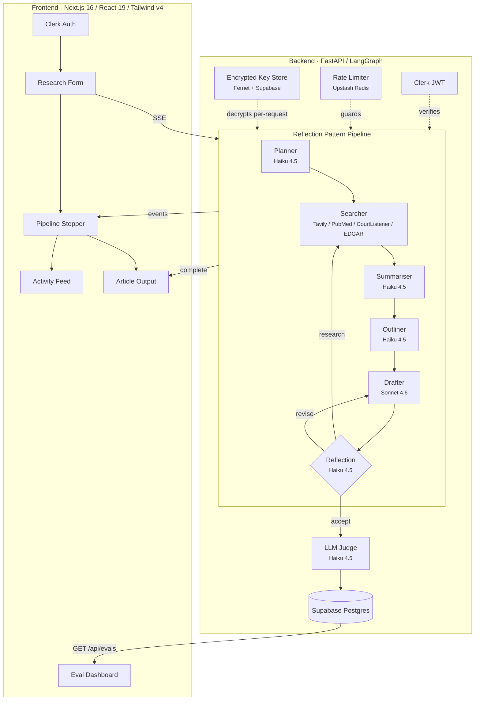
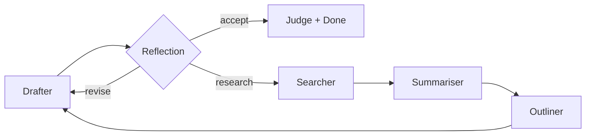
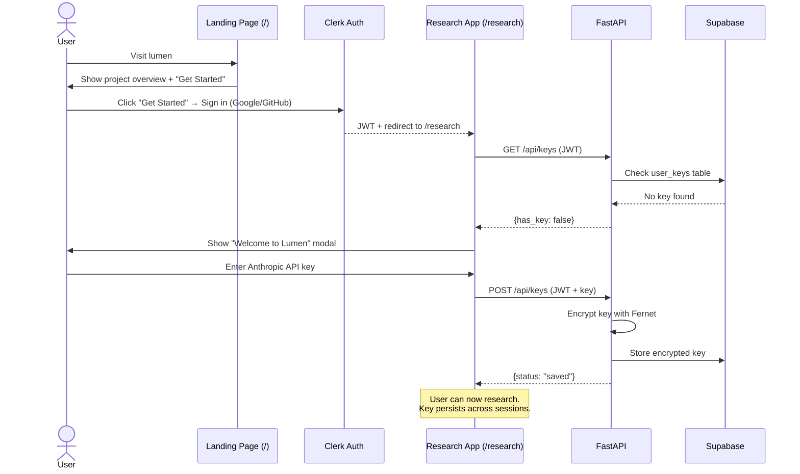
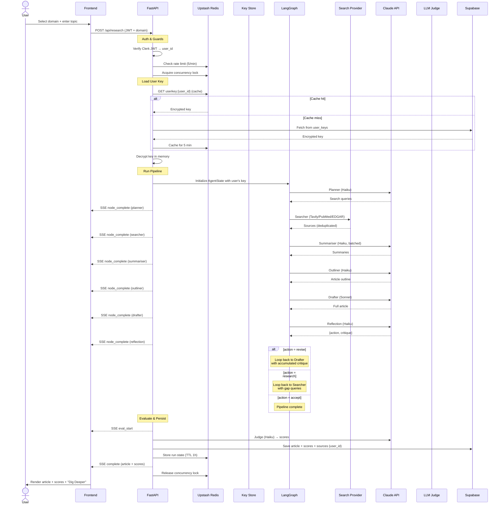
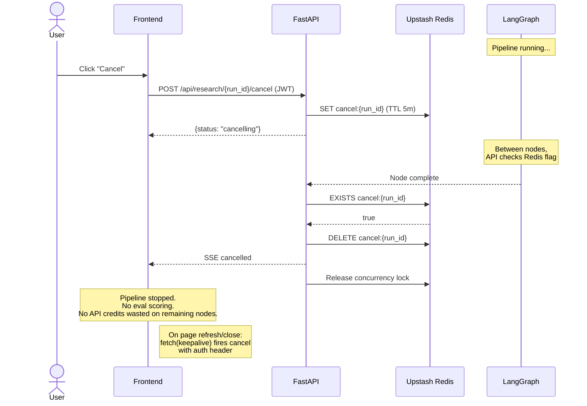
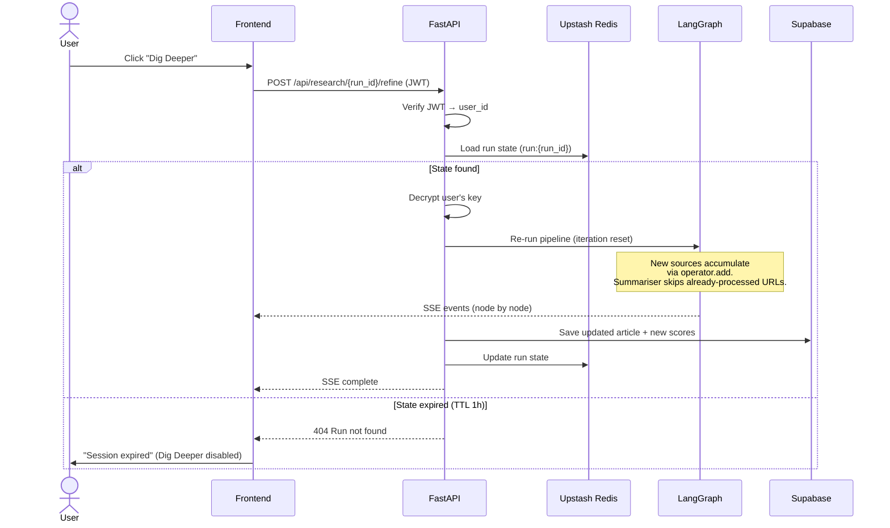
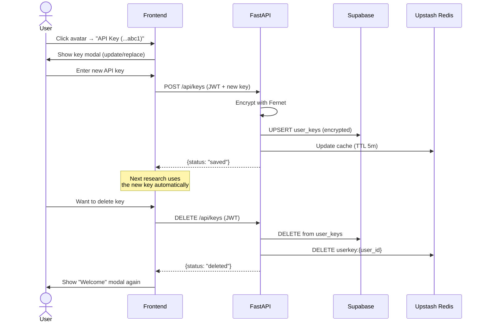
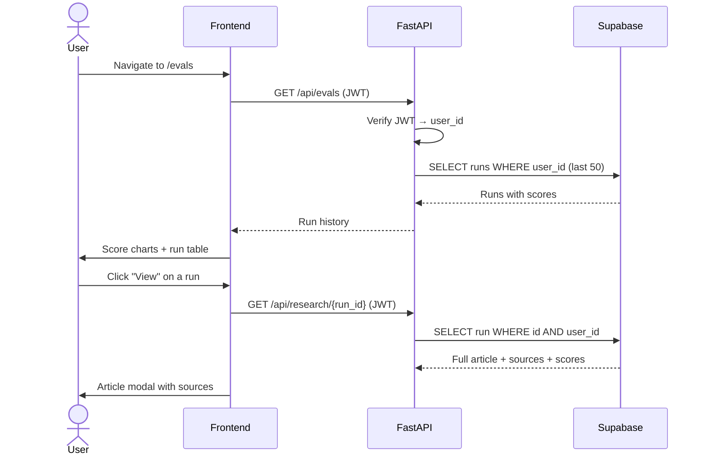

# Lumen

An AI research agent that searches the web, synthesises sources, and writes structured articles — with a self-improving reflection loop, real-time pipeline visibility, and LLM-as-judge evaluation.

Built to demonstrate how to architect a production-grade agentic system with observability, cost controls, and iterative refinement.


## Architecture



### Pipeline Nodes

| Node | Model | What it does |
|------|-------|-------------|
| **Planner** | Haiku 4.5 | Generates targeted search queries from the topic |
| **Searcher** | Tavily / PubMed / CourtListener / SEC EDGAR | Domain-specific web search with URL deduplication across iterations |
| **Summariser** | Haiku 4.5 | Batches all new sources into a single LLM call, extracts key facts |
| **Outliner** | Haiku 4.5 | Plans article structure with section headings and source assignments (first pass only) |
| **Drafter** | Sonnet 4.6 | Writes the article following the outline; on revisions, receives prior draft + accumulated critique |
| **Reflection** | Haiku 4.5 | Critiques draft on coverage, evidence, structure, accuracy. Routes to `accept`, `revise`, or `research` |

### Post-Pipeline Evaluation

After the pipeline completes (reflection accepts), the draft is scored by an **LLM-as-judge** (Haiku 4.5) on quality, relevance, and groundedness (1-5). Scores are persisted to Supabase alongside the article text and source URLs, linked to the authenticated user.

### Model Split Strategy

Only the **Drafter** uses Claude Sonnet 4.6. Every other node — including the judge — runs on Claude Haiku 4.5:

| Node | Model | Why |
|------|-------|-----|
| **Planner** | Haiku 4.5 | Outputs a JSON array of search queries. Structured, constrained. |
| **Summariser** | Haiku 4.5 | Fact extraction, not creative writing. |
| **Outliner** | Haiku 4.5 | Bullet-point outline with source assignments. |
| **Drafter** | Sonnet 4.6 | The one node where model quality directly affects user-facing output — long-form writing, citations, professional tone. |
| **Reflection** | Haiku 4.5 | JSON classification (accept/revise/research) with critique text. |
| **Judge** | Haiku 4.5 | Outputs 3 numbers in JSON. |

**Cost per run:** ~$0.05 with user's own API key (BYOK).

### Reflection Design Pattern

The reflection node is the core of the agentic loop:



- **`accept`** — Draft is strong. Proceed to scoring.
- **`revise`** — Writing quality issues. Loop back to drafter with critique. No wasted API calls on re-searching.
- **`research`** — Content gaps found. Loop back to searcher with targeted queries, then through the full pipeline.

Critique accumulates in `reflections[]` via `operator.add`. The drafter sees all prior feedback on each revision. The loop is capped at 3 iterations.

### State Accumulation

`search_results`, `summaries`, `summarised_urls`, and `reflections` use LangGraph's `operator.add` — each iteration appends, never overwrites. The summariser tracks processed URLs to avoid re-summarising sources from prior passes.

## Authentication & Key Management

### Sign-in

Users authenticate via Clerk (Google/GitHub OAuth). All API endpoints require a valid JWT.

### BYOK (Bring Your Own Key)

On first sign-in, users are prompted to enter their Anthropic API key. The key is:

1. **Encrypted** with Fernet (AES-128-CBC) using a server-side encryption key
2. **Stored** in Supabase `user_keys` table (only the ciphertext, never the raw key)
3. **Cached** in Upstash Redis for 5 minutes (encrypted form only) to avoid hitting Supabase on every request
4. **Decrypted** per-request in memory, used for the LLM call, then discarded
5. **Never logged**, never sent to third parties, stripped from pipeline state before persistence

Users can update or delete their key from the Clerk avatar dropdown menu.

### Why BYOK

The operator (you) pays nothing for LLM costs. Users pay with their own Anthropic keys. The domain search providers (PubMed, CourtListener, SEC EDGAR) are free government/nonprofit APIs — no keys needed. Tavily (General domain) uses the server's key.

## Frontend

### Routes

| Route | Auth | Description |
|-------|------|-------------|
| `/` | Public | Landing page — project overview, features, sign-in CTA |
| `/sign-in` | Public | Clerk sign-in (handles both sign-in and sign-up) |
| `/research` | Required | Research app — pipeline, activity feed, article output |
| `/evals` | Required | Eval dashboard — score history, article viewer |

Unauthenticated users visiting `/research` or `/evals` are redirected to Clerk's sign-in. The landing page shows what Lumen is before requiring auth.

### Horizontal Pipeline Stepper

A persistent stepper shows all 6 nodes as dots with connecting lines. Nodes transition from pending → running → complete. On reflection loops, a "Pass 2" header appears with the reflection action and a tooltip showing the critique on hover.

When the article is generated, the stepper collapses to compact mode.

### Activity Feed

Live feed of each node's output — search queries, source titles with URLs, outline sections, word counts, and reflection decisions rendered as markdown. Entries are grouped by pass.

### Article / Activity Tabs

- **Activity** — active during the pipeline run, shows node-by-node progress
- **Article** — auto-selected when the run completes, shows scores + article + sources

State is preserved in `sessionStorage` so navigating to the Eval Dashboard and back doesn't lose your article.

### Eval Dashboard

Shows the last 50 scored runs for the authenticated user. Click **View** to open the full article with sources in a modal. Score trend charts visualise quality over time.

## Domain-Specific Research

Four research domains, each with its own search provider and prompt context:

| Domain | Search Provider | Cost | What it searches |
|--------|----------------|------|-----------------|
| **General** | Tavily | Server key | General web — news, blogs, documentation |
| **Medical** | PubMed (NCBI) | Free | 36M+ biomedical papers, clinical trials, meta-analyses |
| **Legal** | CourtListener | Free | US federal/state court opinions, case law |
| **Financial** | SEC EDGAR | Free | Public company filings — 10-K, 10-Q, 8-K |

Each domain is a YAML config in `backend/domains/`. The config provides context appended to each node's prompt — query terminology, extraction focus, output template, and validation rules. Adding a new domain requires only a YAML file, no code changes.

**The agentic pattern is domain-agnostic. The context layer is domain-specific.**

## Workflows

### 1. First-Time User Flow



### 2. Research Flow



### 3. Cancellation Flow



### 4. Refinement Flow ("Dig Deeper")



### 5. Key Management Flow



### 6. Eval Dashboard Flow



## Rate Limiting

With BYOK, rate limiting protects server resources, not costs. Users pay with their own API keys.

| Limit | Value | Why |
|-------|-------|-----|
| Per-user per-minute | 5 requests | Prevents scripted abuse |
| Concurrent pipelines | 1 per user | Prevents server resource exhaustion |
| Evals reads | 30/min per user | Read-only, lightweight |

Rate limits are implemented in Upstash Redis (sorted sets) so they work across horizontally scaled instances.

### Cost Controls

| Control | Impact |
|---------|--------|
| Sonnet only for drafter, Haiku for all other nodes | ~75% cost reduction vs all-Sonnet |
| Batched summariser (1 LLM call for all sources) | ~60% fewer summariser tokens |
| Source deduplication in searcher | No duplicate results across loops |
| Only summarise new sources on loops | No re-processing of prior iteration sources |
| Revision drafter skips old summaries | Already incorporated in the draft |
| Two-tier LLM cache (L1 local LRU + L2 Redis, 7-day TTL) | L1 serves repeated prompts in 0ms with zero Redis commands; L2 persists across restarts |
| Outliner runs first pass only | No redundant planning on revision loops |

## Tech Stack

| Layer | Technology |
|-------|-----------|
| Frontend | Next.js 16, React 19, TypeScript, Tailwind CSS v4 |
| UI | Motion, Recharts, Zod v4, DM Sans/Mono |
| Auth | Clerk (OAuth, JWT) |
| Backend | FastAPI, Python 3.11+, Uvicorn |
| Orchestration | LangGraph 1.1.3 |
| LLM | Claude Sonnet 4.6 (drafter) + Haiku 4.5 (all other nodes) |
| Search | Tavily, PubMed, CourtListener, SEC EDGAR |
| Database | Supabase Postgres |
| Cache & State | Upstash Redis |
| Key Encryption | Fernet (AES-128-CBC) |
| Tracing | LangSmith |

## Tradeoffs

| Decision | Upside | Downside |
|----------|--------|----------|
| Supabase Postgres | Persistent, per-user data, multi-instance | External dependency (free tier) |
| Upstash Redis | Survives restarts, native TTL, shared state | 10K cmds/day limit on free tier |
| Clerk for auth | OAuth, JWT, zero auth code to maintain | Vendor lock-in |
| BYOK with encrypted storage | Zero operator LLM cost, keys encrypted at rest | Users must have an Anthropic API key |
| SSE + REST cancel | Simple streaming, cancel between nodes | Can't cancel mid-node |
| Sonnet only for drafter | ~75% cost savings | Lighter model on extraction tasks |
| Two-tier cache (L1 local + L2 Redis) | L1 eliminates Redis calls on hot paths; L2 survives restarts | L1 lost on restart (by design); 256MB Redis limit on free tier |
| Reflection loop (max 3) | Self-improving output | Up to 3x cost on worst case |
| YAML domain configs | Non-developers can edit domain context | Requires server restart |

## Getting Started

### Prerequisites

- Python 3.11+
- Node.js 18+
- [pnpm](https://pnpm.io/)
- [Clerk](https://clerk.com/) account (free)
- [Supabase](https://supabase.com/) project (free)
- [Upstash](https://upstash.com/) Redis (free)
- [Anthropic API key](https://console.anthropic.com/) (for your own testing)

### Setup

1. **Create Supabase tables:**

```sql
CREATE TABLE runs (
    id TEXT PRIMARY KEY,
    user_id TEXT,
    topic TEXT,
    created_at TIMESTAMPTZ DEFAULT NOW(),
    draft TEXT,
    sources JSONB DEFAULT '[]',
    quality FLOAT,
    relevance FLOAT,
    groundedness FLOAT,
    latency_ms INTEGER,
    total_tokens INTEGER,
    estimated_cost_usd FLOAT,
    node_timings JSONB DEFAULT '{}',
    token_counts JSONB DEFAULT '{}'
);

CREATE INDEX idx_runs_user_id ON runs(user_id);

CREATE TABLE user_keys (
    user_id TEXT PRIMARY KEY,
    encrypted_anthropic_key TEXT NOT NULL,
    key_preview TEXT NOT NULL,
    created_at TIMESTAMPTZ DEFAULT NOW(),
    updated_at TIMESTAMPTZ DEFAULT NOW()
);
```

2. **Generate encryption key:**

```bash
python3 -c "from cryptography.fernet import Fernet; print(Fernet.generate_key().decode())"
```

3. **Backend:**

```bash
cd backend
python3 -m venv venv && source venv/bin/activate
pip install -r requirements.txt
pip install -e ".[dev]"  # test dependencies (pytest, pytest-asyncio, freezegun)
cp ../.env.example .env  # add your keys
python3 -m uvicorn main:app --reload --port 8000
```

Run the test suite:

```bash
python3 -m pytest
```

4. **Frontend:**

```bash
cd frontend
pnpm install
cp .env.local.example .env.local  # add Clerk publishable key
pnpm dev
```

Open [http://localhost:3000](http://localhost:3000) — you'll see the landing page. Sign in to access `/research`.

## Environment Variables

### Backend (`.env`)

| Variable | Required | Description |
|---|---|---|
| `CLERK_SECRET_KEY` | Yes | Clerk secret key for JWT verification |
| `CLERK_ISSUER_URL` | Yes | Clerk JWT issuer URL (e.g. `https://your-instance.clerk.accounts.dev`) |
| `ENCRYPTION_KEY` | Yes | Fernet key for encrypting user API keys |
| `SUPABASE_URL` | Yes | Supabase project URL |
| `SUPABASE_KEY` | Yes | Supabase publishable (anon) key |
| `UPSTASH_REDIS_URL` | Yes | Upstash Redis REST URL |
| `UPSTASH_REDIS_TOKEN` | Yes | Upstash Redis REST token |
| `TAVILY_API_KEY` | Yes | Tavily key for General domain search |
| `ANTHROPIC_API_KEY` | No | For dev testing (users provide via BYOK) |
| `LUMEN_DEV_CACHE` | No | Two-tier LLM cache — L1 local + L2 Redis (default: `true`) |
| `CORS_ORIGINS` | No | Allowed origins (default: `http://localhost:3000`) |
| `LANGSMITH_API_KEY` | No | LangSmith tracing key |
| `LANGSMITH_TRACING` | No | Enable tracing (`true`/`false`) |

### Frontend (`.env.local`)

| Variable | Required | Description |
|---|---|---|
| `NEXT_PUBLIC_CLERK_PUBLISHABLE_KEY` | Yes | Clerk publishable key |
| `CLERK_SECRET_KEY` | Yes | Clerk secret key (for middleware) |
| `NEXT_PUBLIC_API_URL` | No | Backend URL (default: `http://localhost:8000`) |

## Guardrails

- **Authentication** — Clerk OAuth with JWT verification on all API endpoints
- **Encrypted key storage** — User API keys encrypted with Fernet, cached in Redis (encrypted form), decrypted per-request only
- **Rate limiting** — 5/min per user + 1 concurrent pipeline via Upstash Redis
- **Input validation** — 3-500 character topics with prompt injection blocking
- **Pipeline cancellation** — Cancel button + `fetch(keepalive)` with auth on page unload; Redis flag checked between nodes
- **SSE validation** — Zod discriminated union schemas on all streaming events
- **Source deduplication** — No duplicate URLs across search iterations
- **Cost controls** — BYOK (zero operator cost), Haiku for 5/6 nodes, batching, caching
- **Article persistence** — Draft, sources, and scores saved per user in Supabase
- **Domain isolation** — YAML configs, no code changes to add domains

## Handling Context Failure

The hardest problem in agentic systems isn't the model — it's context. An agent that guesses wrong at scale destroys user trust. Lumen's pipeline catches context failures at every layer:

| Layer | What it prevents |
|-------|-----------------|
| **Planner** | Multiple targeted queries reduce the chance of missing an angle |
| **Searcher** | URL deduplication prevents one source from inflating its weight |
| **Summariser** | Batched extraction lets the model see all sources together and identify contradictions |
| **Outliner** | Maps sources to sections — the drafter doesn't guess which evidence supports which claim |
| **Reflection** | Catches gaps, unsupported claims, and structural issues before delivery |
| **Judge** | Makes quality visible — a low groundedness score signals weak citations |

The reflection loop is the critical layer. Without it, the pipeline is a one-shot generator. With it, the system self-corrects through up to 3 iterations of targeted revision or research.

## Infrastructure

All infrastructure runs on free tiers with no credit card required.

| Component | Service | Free tier |
|-----------|---------|-----------|
| **Auth** | Clerk | 10K MAU |
| **Database** | Supabase Postgres | 500MB |
| **L1 Cache** | In-memory LRU (per-process) | N/A — built-in |
| **L2 Cache & State** | Upstash Redis | 500K cmds/month |
| **Search** | PubMed, CourtListener, SEC EDGAR | Unlimited |
| **LLM** | User's own key (BYOK) | N/A |

### Caching Architecture

```
Request → L1 Local LRU (0ms) → L2 Redis (2ms) → LLM API (10-60s)
```

LLM responses are cached in two tiers. The local LRU (100 entries, per-process) handles repeated prompts with zero network calls. On L1 miss, Redis serves as a shared persistent cache across instances with 7-day TTL. On a fresh topic, ~12 Redis commands are used (6 GET misses + 6 SET writes). On a repeated topic from the same server, 0 Redis commands — everything served from L1.

The pipeline is infrastructure-agnostic. Swapping Redis for Memcached or Supabase for any Postgres provider requires changing only `evals/store.py` and `redis_services.py`. The agentic layer is untouched.

## API Reference

All endpoints require a Clerk JWT in the `Authorization: Bearer <token>` header (except `/healthz` and `/api/domains`).

| Method | Endpoint | Auth | Description |
|--------|----------|------|-------------|
| `GET` | `/healthz` | No | Health check |
| `GET` | `/api/domains` | No | List available research domains |
| `POST` | `/api/research` | Yes | Start a research pipeline (SSE stream) |
| `POST` | `/api/research/{id}/refine` | Yes | Re-run pipeline on existing research (SSE stream) |
| `POST` | `/api/research/{id}/cancel` | Yes | Cancel a running pipeline |
| `GET` | `/api/research/{id}` | Yes | Fetch a saved article with scores |
| `GET` | `/api/evals` | Yes | List user's last 50 eval runs |
| `GET` | `/api/keys` | Yes | Check if user has a saved API key (preview only) |
| `POST` | `/api/keys` | Yes | Encrypt and save user's Anthropic API key |
| `DELETE` | `/api/keys` | Yes | Delete user's saved API key |

### SSE Events

The research and refine endpoints stream Server-Sent Events:

| Event | When | Payload |
|-------|------|---------|
| `start` | Pipeline begins | `{run_id, topic, domain}` |
| `node_complete` | A node finishes | `{node, timing_ms, iteration, meta, reflection_action?, critique?}` |
| `eval_start` | Scoring begins | `{}` |
| `complete` | Pipeline done | `{draft, sources, scores, node_timings, token_counts, run_id}` |
| `cancelled` | Pipeline stopped | `{run_id}` |
| `error` | Pipeline failed | `{detail}` |

## Failure Modes

What happens when each external dependency fails:

| Failure | Impact | Mitigation |
|---------|--------|------------|
| **Clerk down** | Users can't sign in or make API calls | JWT tokens are cached client-side; existing sessions continue working until token expires (~1 hour) |
| **Supabase down** | Can't save articles or fetch evals; key lookup fails | Redis key cache serves decrypted keys for 5 min. Pipeline still runs — just can't persist results. User sees error on eval dashboard. |
| **Upstash Redis down** | No rate limiting, no run state, no cache | Pipeline still runs (cache miss = direct LLM call). Rate limits fail-open (allow requests). Run state can't be saved (Dig Deeper won't work). |
| **Claude API down** | Pipeline fails at first LLM node | SSE `error` event sent to frontend. Activity feed shows "Pipeline Error" with the detail. User's key is not charged for failed calls. |
| **Tavily down** | General domain search fails | SSE `error` event. Medical/Legal/Financial domains unaffected (different providers). |
| **PubMed/CourtListener/EDGAR down** | Specific domain search fails | SSE `error` event. Other domains unaffected. User can switch domain. |

Design principle: **fail-open on guards, fail-visible on data**. Rate limiting and caching fail silently (allow the request). Data operations fail with a clear error message to the user.

## Monitoring

| Layer | Tool | What it tracks |
|-------|------|---------------|
| **LLM traces** | LangSmith | Full LangGraph execution traces, token usage, latency per node, prompt debugging |
| **Eval quality** | Built-in `/evals` dashboard | Quality/relevance/groundedness scores over time, regression detection |
| **API errors** | FastAPI → SSE `error` events | Pipeline errors streamed to frontend in real-time |
| **Infrastructure** | Supabase + Upstash dashboards | Database size, Redis command count, API latency |

For production, add Sentry (free tier) for error tracking and OpenTelemetry for distributed tracing across the FastAPI → LangGraph → Claude call chain.

## Deployment

| Component | Platform |
|-----------|----------|
| **Frontend** | Vercel |
| **Backend** | Render |
| **Database** | Supabase (managed) |
| **Cache** | Upstash Redis (managed) |
| **Auth** | Clerk (managed) |
| **LLM tracing** | LangSmith (managed) |

The backend is stateless — all state lives in Redis and Supabase. This means the backend scales horizontally without code changes: add more Render instances behind a load balancer and they share the same Redis state, rate limits, and database.

```
Users → Vercel (Next.js) → Render (FastAPI) → Supabase + Upstash + Clerk
                                             → Claude API (user's key)
                                             → PubMed / CourtListener / EDGAR
                                             → LangSmith (traces)
```

## Next Phase

- **Directed refinement** — Replace "Dig Deeper" with natural language input. Feed user instructions directly into the reflection loop.
- **Model-agnostic provider** — Let users choose Claude, GPT-4, Gemini, or local models.
- **Multi-agent research** — Parallel searcher subgraphs for different angles, merged before drafting.
- **Research library** — Save and revisit past research per user.
- **Eval regression CI** — Automated quality checks on prompt changes.
- **Domain source authority** — Curated source ranking per domain.
