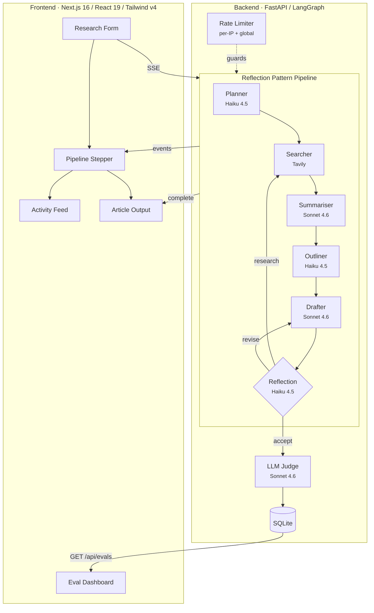
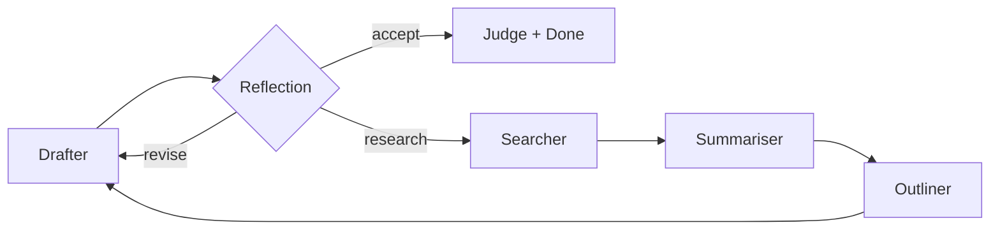
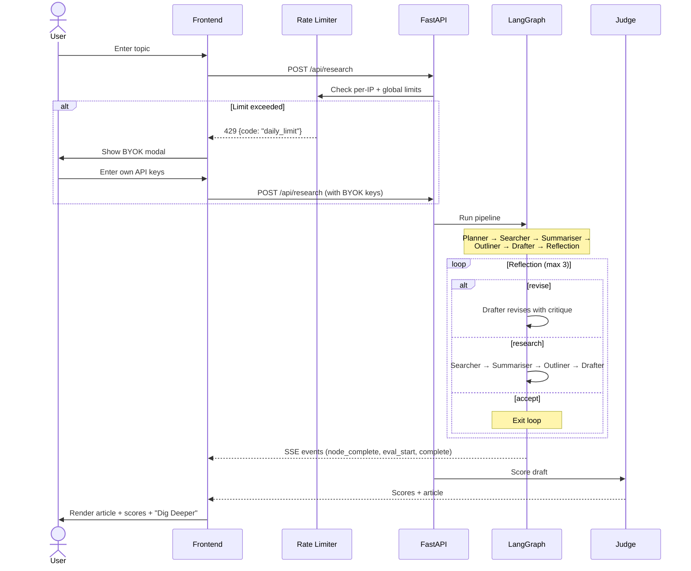
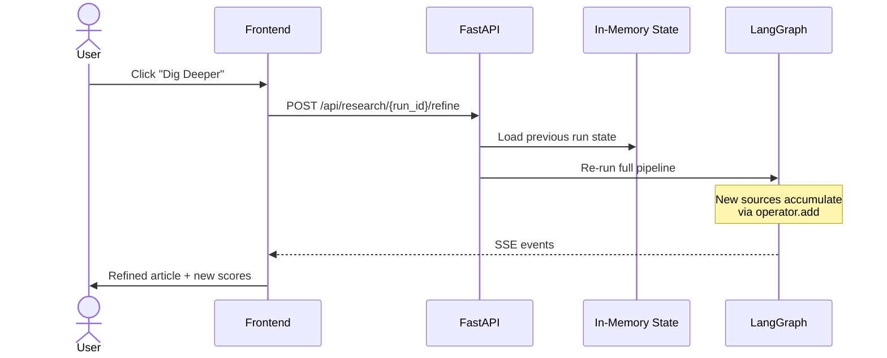
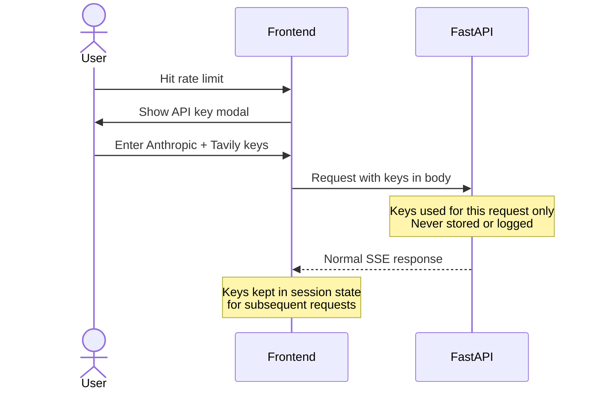

# Lumen

An AI research agent that searches the web, synthesises sources, and writes structured articles — with a self-improving reflection loop, real-time pipeline visibility, and LLM-as-judge evaluation.

Built to demonstrate how to architect a production-grade agentic system with observability, cost controls, and iterative refinement.

<!-- TODO: Replace with your own screenshot or GIF -->

<!-- Record a GIF with: research topic → pipeline stepper animating → reflection loop → article output with scores -->

## Architecture



### Pipeline Nodes

| Node | Model | What it does |
|------|-------|-------------|
| **Planner** | Haiku 4.5 | Generates targeted search queries from the topic |
| **Searcher** | Tavily / PubMed / CourtListener / SEC EDGAR | Domain-specific web search with URL deduplication across iterations |
| **Summariser** | Haiku 4.5 | Batches all new sources into a single LLM call, extracts key facts |
| **Outliner** | Haiku 4.5 | Plans article structure with section headings and source assignments (first pass only) |
| **Drafter** | Sonnet 4.6 | Writes the article following the outline; on revisions, receives prior draft + accumulated critique |
| **Reflection** | Haiku 4.5 | Critiques draft on coverage, evidence, structure, accuracy. Routes to `accept`, `revise`, or `research` |

### Post-Pipeline Evaluation

After the pipeline completes (reflection accepts), the draft is scored by an **LLM-as-judge** (Haiku 4.5) on quality, relevance, and groundedness (1-5). This runs outside the LangGraph as a separate evaluation step — scores are persisted to SQLite alongside the article and source URLs.

### Model Split Strategy

Only the **Drafter** uses Claude Sonnet 4.6. Every other node — including the judge — runs on Claude Haiku 4.5. This is a deliberate cost optimization based on what each node actually does:

| Node | Model | Why this model |
|------|-------|---------------|
| **Planner** | Haiku 4.5 | Outputs a JSON array of 2 search queries. Structured, constrained — Haiku handles this perfectly. |
| **Summariser** | Haiku 4.5 | Extracts facts from source text into numbered summaries. An extraction task, not creative writing — Haiku's precision is sufficient. |
| **Outliner** | Haiku 4.5 | Produces a bullet-point outline with source assignments. Structured planning that doesn't need Sonnet's reasoning depth. |
| **Drafter** | Sonnet 4.6 | Writes the final 1,000-1,500 word article. This is the one node where model quality directly affects user-facing output — coherent long-form writing, proper structure, inline citations, and professional tone require the strongest model. |
| **Reflection** | Haiku 4.5 | Returns a JSON object with action + critique. A classification task (accept/revise/research) with a text explanation — well within Haiku's capability. |
| **Judge** | Haiku 4.5 | Outputs 3 numbers in JSON (quality, relevance, groundedness). The simplest output format in the pipeline — Haiku scores as reliably as Sonnet for structured evaluation. |

**Cost impact:** ~$0.05 per run (down from ~$0.08 with Sonnet on summariser/judge). At the daily cap of 100 runs, worst-case daily spend is ~$5.

### Reflection Design Pattern

The reflection node is the core of the agentic loop. It evaluates the draft and decides what happens next:



- **`accept`** — Draft is strong. Proceed to scoring.
- **`revise`** — Writing quality issues (structure, clarity, argument strength). Loop back to drafter with critique. No wasted API calls on re-searching.
- **`research`** — Content gaps found. Loop back to searcher with targeted queries, then through the full pipeline.

Critique accumulates in `reflections[]` via `operator.add`. The drafter sees all prior feedback on each revision. The loop is capped at 3 iterations.

### State Accumulation

`search_results`, `summaries`, `summarised_urls`, and `reflections` use LangGraph's `operator.add` — each iteration appends, never overwrites. The summariser tracks processed URLs to avoid re-summarising sources from prior passes.

## Frontend

The frontend has three main views, designed so you can follow every step of the pipeline without scrolling or losing context.

### Horizontal Pipeline Stepper

A persistent stepper at the top shows all 6 nodes as dots with connecting lines. Nodes transition from pending (gray) → running (amber pulse) → complete (green check). On reflection loops, a "Pass 2 — Researching" header appears above the stepper with the reflection critique.

When the article is generated, the stepper collapses to compact mode (just the dots) to maximize space for the article.

### Activity Feed

During the pipeline run, the Activity tab shows a live feed of each node's output as it completes — search queries, source titles with URLs, outline sections, word counts, and reflection decisions. Entries are grouped by pass with clear headers.

After completion, switching to the Activity tab lets you review the full trace of what happened, including multi-pass reflection decisions and their critique text.

### Article / Activity Tabs

The content area has two tabs:
- **Activity** — active during the pipeline run, shows node-by-node progress with real data
- **Article** — auto-selected when the run completes, shows scores + article + sources

State is preserved in `sessionStorage` so navigating to the Eval Dashboard and back doesn't lose your article.

### Eval Dashboard

Navigate to `/evals` to view the last 50 scored runs. Each row shows quality, relevance, groundedness, latency, token count, and cost. Click **View** to open the full article with sources in a modal. Score trend charts visualise quality over time.

## Domain-Specific Research

The pipeline supports four research domains, each with its own search provider, prompt context, and validation criteria. The domain is selected via a dropdown in the UI and passed with every request.

### Available Domains

| Domain | Search Provider | Cost | What it searches |
|--------|----------------|------|-----------------|
| **General** | Tavily | 1,000 free/month | General web — news, blogs, documentation |
| **Medical** | PubMed (NCBI) | Free, unlimited | 36M+ biomedical papers, clinical trials, meta-analyses |
| **Legal** | CourtListener | Free, unlimited | US federal/state court opinions, case law |
| **Financial** | SEC EDGAR | Free, unlimited | Public company filings — 10-K, 10-Q, 8-K |

### How domains work

Each domain is defined by a YAML config file in `backend/domains/`. The config provides context that is appended to each node's prompt:

- **Planner** — Domain-specific query patterns (e.g., MeSH terms for medical, ticker symbols for financial)
- **Summariser** — What to extract (e.g., p-values and sample sizes for medical, case holdings for legal)
- **Outliner** — Output template (e.g., systematic review format for medical, legal memo format for legal)
- **Reflection** — Validation rules (e.g., "statistical claims need confidence intervals" for medical)

The pipeline graph, state accumulation, and reflection loop don't change between domains — only the context injected into prompts does. Adding a new domain requires only a YAML file, no code changes.

### Why YAML configs

Domain knowledge changes faster than code. A subject matter expert (doctor, lawyer, analyst) can edit the medical config's validation rules without touching Python. YAML's multi-line string support (`|`) makes prompt context readable and editable.

## Quality Scores

Every run is scored by an LLM-as-judge on three dimensions (1.0–5.0). Scores are persisted to SQLite alongside the article text and source URLs.

<!-- TODO: Replace with your actual scores after running 10-20 topics -->

### Sample Eval Results

| Topic | Quality | Relevance | Groundedness | Reflection Loops | Sources |
|-------|---------|-----------|--------------|-----------------|---------|
| AI agents in software development 2026 | 4.5 | 4.2 | 4.0 | 1 (research) | 8 |
| How does RAG work in production systems | 4.3 | 4.5 | 4.2 | 0 | 4 |
| Impact of LLMs on junior developer hiring | 4.1 | 4.0 | 3.8 | 1 (revise) | 4 |
| Edge computing and cloud architecture | 4.4 | 4.3 | 4.1 | 0 | 4 |
| Open source AI vs proprietary models | 4.2 | 4.4 | 4.0 | 1 (research) | 8 |

<!-- Run your own evals and update the table above with real data -->
<!-- Query: sqlite3 lumen_evals.db "SELECT topic, quality, relevance, groundedness FROM runs ORDER BY created_at DESC LIMIT 20" -->

**Key finding:** Runs that trigger a reflection loop consistently score higher on the dimension that triggered the loop. The reflection pattern measurably improves output quality.

## Workflows

### Research Flow



### Refinement Flow ("Dig Deeper")



### BYOK Flow (Bring Your Own Keys)



## Rate Limiting & Cost Protection

This is a portfolio demo — rate limiting prevents bill surprises, not scale for production traffic.

### Limits

| Scope | Limit | Why |
|-------|-------|-----|
| Research per IP | 2/min, 10/hour, 20/day | Prevent single user from running up costs |
| Refine per IP | 3/min, 10/hour | Refines are cheaper but still cost tokens |
| Global daily cap | 100 runs/day (all users) | Hard ceiling on daily spend (~$10-15 worst case) |
| Concurrent pipelines | 1 per IP | Prevent parallel runs multiplying cost |
| Evals reads | 30/min per IP | Read-only, no API cost |

### What happens when limits are hit

| Limit | User experience |
|-------|----------------|
| Per-minute | "Too many requests. Please wait a moment." |
| Hourly/Daily | Modal prompts user to enter their own Anthropic + Tavily API keys |
| Global daily | Same modal — any user can continue with their own keys |
| Concurrent | "A pipeline is already running. Please wait." |

BYOK users bypass all per-IP and global limits. Keys are sent per-request, never stored on the server, and stripped from in-memory state after the run completes.

### Cost Controls

| Control | Impact |
|---------|--------|
| Sonnet only for drafter, Haiku for all other nodes + judge | ~75% cost reduction vs all-Sonnet |
| Batched summariser (1 LLM call for all sources) | ~60% fewer summariser tokens |
| Source deduplication in searcher | No duplicate Tavily results across loops |
| Only summarise new sources on loops | No re-processing of prior iteration sources |
| Revision drafter skips old summaries | Old summaries are already in the draft |
| Disk cache (`LUMEN_DEV_CACHE=true`) | Zero API cost on repeated dev runs |
| Outliner runs first pass only | No redundant planning on revision loops |

## Tech Stack

| Layer | Technology |
|-------|-----------|
| Frontend | Next.js 16, React 19, TypeScript, Tailwind CSS v4 |
| UI | Framer Motion, Recharts, Zod v4, DM Sans/Mono |
| Auth | Clerk (OAuth with Google/GitHub, JWT) |
| Backend | FastAPI, Python 3.11+, Uvicorn |
| Orchestration | LangGraph 1.1.3 |
| LLM | Claude Sonnet 4.6 (drafter) + Haiku 4.5 (all other nodes) via LangChain-Anthropic |
| Search | Tavily (general), PubMed (medical), CourtListener (legal), SEC EDGAR (financial) |
| Database | Supabase Postgres |
| Cache & State | Upstash Redis |
| Tracing | LangSmith (optional) |

## Tradeoffs

| Decision | Upside | Downside |
|----------|--------|----------|
| Supabase Postgres over SQLite | Persistent across deploys, per-user research history, multi-instance | External dependency (free tier) |
| Upstash Redis for state | Survives restarts, shared across instances, native TTL | External dependency (free tier, 10K cmds/day limit) |
| Clerk for auth | OAuth (Google/GitHub), JWT, per-user rate limits, 10K MAU free | Vendor lock-in, external dependency |
| BYOK-only for LLM costs | Zero operator cost, users pay their own API usage | Higher friction for new users (must have API keys) |
| SSE + REST cancel | Simple streaming with separate cancel endpoint; `sendBeacon` on page unload | Cancel takes effect between nodes, not mid-node |
| Sonnet only for drafter | ~75% cost savings | Summariser/judge slightly less nuanced on edge cases |
| Disk cache by prompt hash | Zero cost on repeated dev runs | Manual invalidation; stale after model updates |
| Reflection loop (max 3) | Self-improving output | Up to 3x cost on worst case |
| Batched summariser | Fewer LLM calls | Parsing numbered output is fragile |
| YAML domain configs | Non-developers can edit domain context | Requires server restart to pick up changes |

## Getting Started

### Prerequisites

- Python 3.11+
- Node.js 18+
- [pnpm](https://pnpm.io/)
- [Clerk](https://clerk.com/) account (free — auth)
- [Supabase](https://supabase.com/) project (free — database)
- [Upstash](https://upstash.com/) Redis (free — state/cache)
- [Anthropic API key](https://console.anthropic.com/) (for your own testing; users bring their own via BYOK)

### Backend

```bash
cd backend
python3 -m venv venv && source venv/bin/activate
pip install -r requirements.txt
cp ../.env.example .env  # add your API keys
python3 -m uvicorn main:app --reload --port 8000
```

### Frontend

```bash
cd frontend
pnpm install
pnpm dev
```

Open [http://localhost:3000](http://localhost:3000)


## Environment Variables

### Backend (`.env`)

| Variable | Required | Description |
|---|---|---|
| `CLERK_SECRET_KEY` | Yes | Clerk secret key for JWT verification |
| `SUPABASE_URL` | Yes | Supabase project URL |
| `SUPABASE_KEY` | Yes | Supabase publishable (anon) key |
| `UPSTASH_REDIS_URL` | Yes | Upstash Redis REST URL |
| `UPSTASH_REDIS_TOKEN` | Yes | Upstash Redis REST token |
| `ANTHROPIC_API_KEY` | No | Claude API key (for dev testing; users provide via BYOK) |
| `TAVILY_API_KEY` | No | Tavily API key (for dev testing; users provide via BYOK) |
| `LUMEN_DEV_CACHE` | No | Disk cache for LLM/Tavily calls (default: `true`) |
| `LUMEN_DAILY_CAP` | No | Global daily research run limit (default: `100`) |
| `CORS_ORIGINS` | No | Allowed origins (default: `http://localhost:3000`) |
| `LANGSMITH_API_KEY` | No | LangSmith tracing key |
| `LANGSMITH_TRACING` | No | Enable tracing (`true`/`false`) |

### Frontend (`.env.local`)

| Variable | Required | Description |
|---|---|---|
| `NEXT_PUBLIC_CLERK_PUBLISHABLE_KEY` | Yes | Clerk publishable key for client-side auth |

## Handling Context Failure

The hardest problem in agentic systems isn't the model — it's context. An agent that guesses wrong at scale destroys user trust. Lumen's pipeline is designed with multiple layers to catch context failures before they reach the user.

### The problem

A research agent faces the same ambiguity as a data agent querying internal databases. "What was revenue growth last quarter?" has hidden complexity (ARR vs run rate? fiscal vs calendar quarter? which table?). For web research, the equivalent is: which sources are authoritative? Is this claim evidence-backed or speculation? Do these two sources contradict each other?

Most research agents generate a first draft and ship it. Lumen doesn't.

### How each pipeline layer addresses it

| Layer | Context failure it prevents |
|-------|---------------------------|
| **Planner** | Generates multiple targeted queries instead of one vague search — reduces the chance of missing an entire angle of the topic |
| **Searcher** | Deduplicates URLs across iterations so the same source doesn't inflate its weight in the article |
| **Summariser** | Extracts only topic-relevant facts from each source, filtering noise. Batched into one call so the model sees all sources together and can identify contradictions |
| **Outliner** | Maps specific sources to specific sections before drafting — the drafter doesn't guess which evidence supports which claim |
| **Drafter** | Follows the outline's source assignments and cites inline. On revision loops, receives accumulated critique so it knows exactly what to fix |
| **Reflection** | Evaluates coverage, evidence, structure, and accuracy. Catches gaps ("missing benchmarks"), unsupported claims ("stated as fact but no source"), and structural issues ("conclusion repeats intro") before the article reaches the user |
| **Judge** | Scores groundedness (1-5) — makes quality visible. A 2.9 groundedness score tells the user "this article has weak citations" before they trust it |

### What this means architecturally

The reflection loop is the critical layer. Without it, the pipeline is a one-shot generator that guesses and ships. With it, the system self-corrects:

1. Draft makes an unsupported claim → Reflection flags it → Research loop finds evidence → Drafter revises with citations
2. Draft misses a key angle → Reflection identifies the gap → Research loop searches for it → Drafter incorporates it
3. Draft structure is weak → Reflection critiques it → Revise loop fixes structure → No wasted API calls on re-searching

This is the same pattern that production data agents need: a verification layer between generation and delivery. The difference is the context source — Lumen verifies against web sources, a data agent would verify against schema metadata and metric definitions.

### Domain-specific context in practice

Lumen implements four research domains (general, medical, legal, financial), each with its own search provider and prompt context. The same pipeline handles all four — only the injected context changes:

| Layer | What changes per domain |
|-------|------------------------|
| **Planner** | Query terminology (MeSH terms for medical, ticker symbols for financial) |
| **Searcher** | API provider (PubMed, CourtListener, SEC EDGAR instead of Tavily) |
| **Summariser** | Extraction focus (p-values for medical, case holdings for legal) |
| **Outliner** | Output template (systematic review format, legal memo format) |
| **Reflection** | Validation rules ("claims need confidence intervals", "needs case law citation") |

The graph, state accumulation, and reflection loop don't change. This is the key architectural insight: **the agentic pattern is domain-agnostic, but the context layer is domain-specific**.

## Guardrails

- **Authentication** — Clerk OAuth (Google/GitHub) with JWT verification on all API endpoints
- **Input validation** — 3-500 character topics with prompt injection pattern blocking
- **Rate limiting** — Per-user multi-tier limits (minute/hour/day) via Upstash Redis + global daily cap + concurrency limit
- **BYOK mandatory** — Users must provide their own Anthropic + Tavily API keys. Keys are per-request, never stored or logged, stripped from state after runs
- **Pipeline cancellation** — Cancel button sends `POST /cancel`, `sendBeacon` on page unload; backend checks Redis flag between nodes
- **SSE validation** — All streaming events validated with Zod discriminated union schemas
- **Source deduplication** — Prevents duplicate URLs across search iterations
- **Cost controls** — Sonnet only for drafter, Haiku for all other nodes, batching, caching, iteration caps. Operator pays nothing — all LLM costs on user's keys
- **Article persistence** — Draft text, source URLs, and eval scores saved to Supabase Postgres per user
- **Domain isolation** — Domain configs are YAML-only, no code changes needed to add or modify domains
- **State management** — Run states in Upstash Redis with TTL (1 hour), cancellation flags auto-expire (5 minutes)

## Infrastructure

All infrastructure runs on free tiers with no credit card required.

| Component | Service | Free tier | Why this service |
|-----------|---------|-----------|-----------------|
| **Auth** | Clerk | 10K MAU | OAuth (Google/GitHub), JWT, per-user identity without building auth from scratch |
| **Database** | Supabase Postgres | 500MB | Relational queries for eval history, per-user research library, persistent across deploys |
| **State & Cache** | Upstash Redis | 10K cmds/day | Run state with TTL, per-user rate limiting, cancellation flags, distributed concurrency locks |
| **Search** | PubMed, CourtListener, SEC EDGAR | Unlimited | Free government/nonprofit APIs — no usage limits, no API keys needed |
| **LLM** | User's own keys (BYOK) | N/A | Zero operator cost — users bring their own Anthropic + Tavily keys |

### Architecture separation

The pipeline is infrastructure-agnostic by design. The LangGraph, reflection pattern, domain configs, and BYOK system have no knowledge of how state is persisted. Swapping Redis for Memcached or Supabase for any Postgres provider requires changing only `store.py` and the state helpers in `main.py` — the agentic layer is untouched.

## Next Phase

- **Directed refinement** — Replace "Dig Deeper" with natural language input ("add more data on market size"). Feed user instructions directly into the reflection loop.
- **Model-agnostic provider layer** — Abstract LLM calls behind a provider interface so users can choose Claude, GPT-4, Gemini, or local models.
- **Multi-agent research** — Parallel searcher subgraphs for different angles of a topic, merged before drafting.
- **Research library** — Save and revisit past research per user, compare articles across topics.
- **Eval regression CI** — Run a fixed set of topics on every prompt change, compare scores against baseline, block deploys that regress quality.
- **Domain-specific source authority** — Curated source ranking per domain so the searcher prioritizes high-impact journals (medical), binding precedent (legal), or primary filings (financial).
