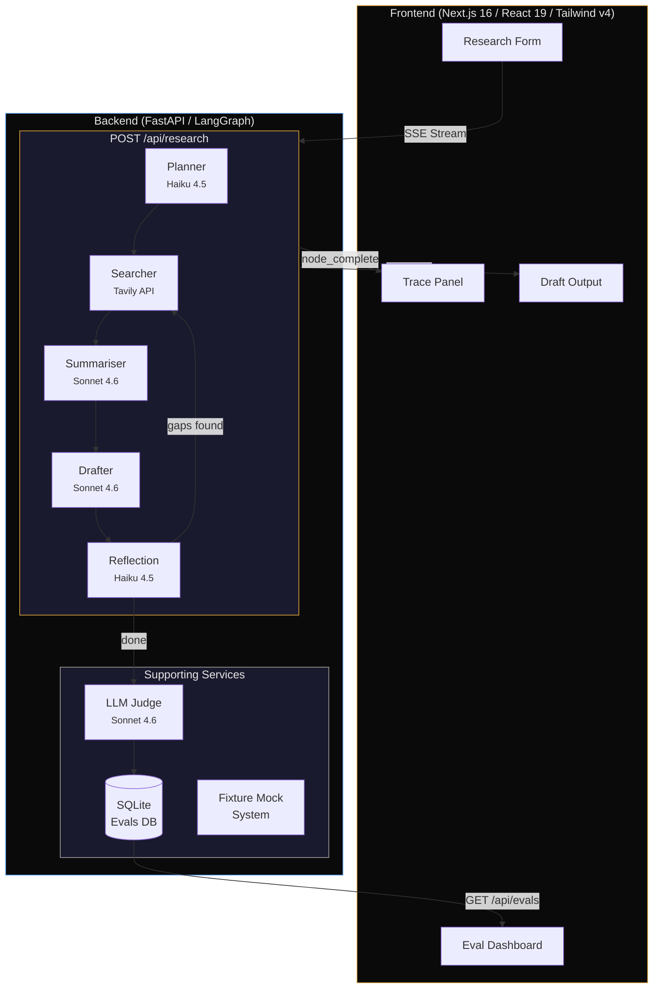
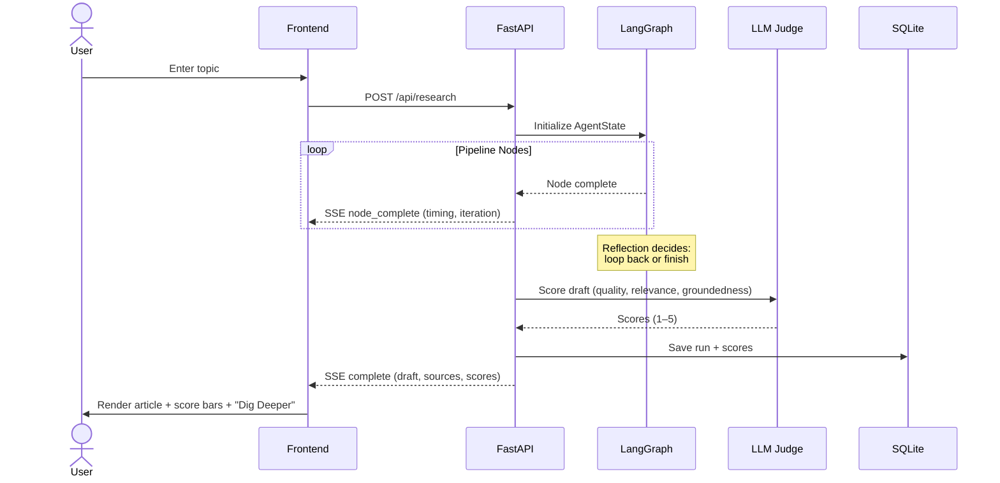
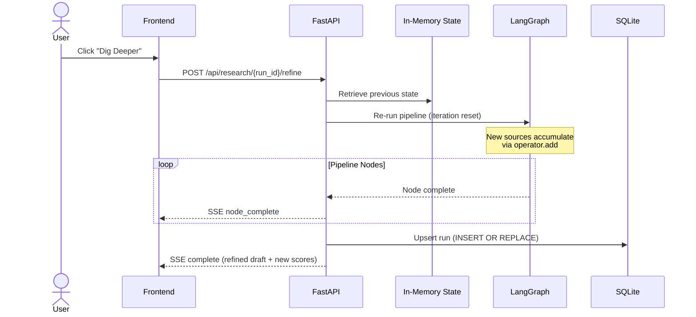
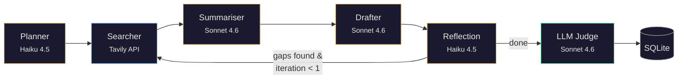
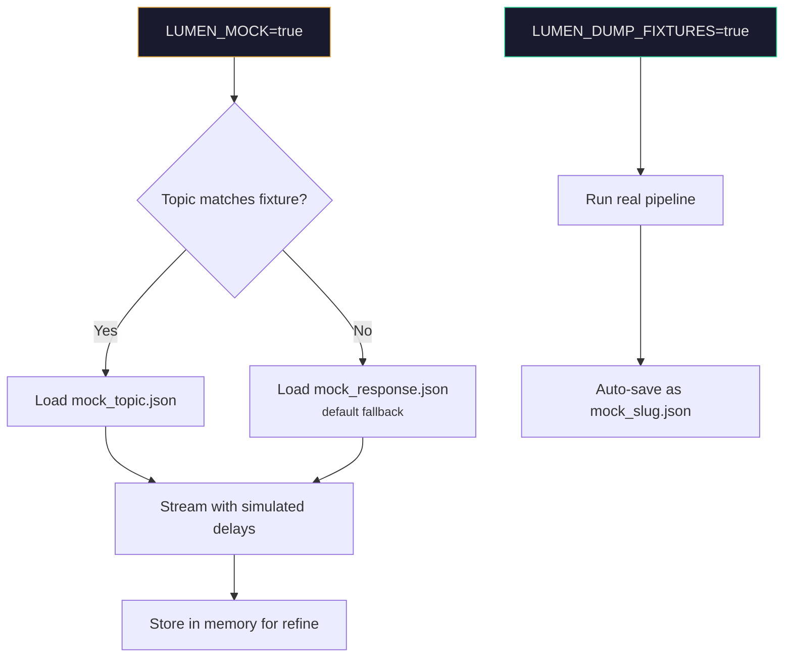

# Lumen: AI Research Agent with Full Observability

## Overview

Lumen is an AI-powered research agent that takes a topic, searches the web, synthesises sources, and produces a structured long-form article — with real-time pipeline visibility, LLM-as-judge quality scoring, and an eval dashboard for tracking output quality over time. It demonstrates how to build a production-grade agentic system with proper observability, cost controls, and iterative refinement rather than a one-shot prompt.

## Key Technical Decisions

**LangGraph over prompt chaining**: The research pipeline is a state machine, not a linear chain. Each node (planner, searcher, summariser, drafter, reflection) reads and writes to a shared `AgentState`, enabling conditional looping — the reflection node can route back to the searcher if it identifies gaps. This makes the system self-correcting without hardcoding iteration counts.

**Streaming SSE over WebSockets**: Research runs take 30-90 seconds. SSE gives the frontend real-time node-by-node progress (timing, iteration count) without the connection management overhead of WebSockets. The tradeoff: SSE is unidirectional, so cancellation requires a separate mechanism — acceptable here since runs are short-lived.

**LLM-as-judge evals**: Every run is scored on quality, relevance, and groundedness (1–5) by a separate Claude call. Scores are persisted to SQLite and surfaced on the `/evals` dashboard. This closes the feedback loop — you can see if a prompt change improves output quality across runs, not just anecdotally.

**Haiku/Sonnet model split**: Lightweight nodes (planner, reflection) use Claude Haiku 4.5; heavy nodes (summariser, drafter) use Claude Sonnet 4.6. This cuts costs ~30-40% with no measurable quality loss on planning and reflection tasks.

**Disk-based LLM caching**: Both Tavily results and Claude responses are cached to `.cache/` keyed by prompt hash. During development, this means re-running the same topic costs zero API credits. The tradeoff: cache invalidation is manual (delete `.cache/`), and cached results don't reflect model updates.

## Architecture



### Pipeline Nodes

| Node | Model | Purpose | Output |
|------|-------|---------|--------|
| **Planner** | Haiku 4.5 | Generates 2 targeted search queries from the topic | `search_queries[]` |
| **Searcher** | — | Runs queries against Tavily API (2 results each, 4 sources total) | `search_results[]` |
| **Summariser** | Sonnet 4.6 | Condenses each source into a markdown summary with citation | `summaries[]` |
| **Drafter** | Sonnet 4.6 | Synthesises summaries into a structured article (H1, sections, sources) | `draft` |
| **Reflection** | Haiku 4.5 | Critiques the draft, decides whether to loop for more research | `should_continue`, `reflection` |

### State Accumulation

`search_results` and `summaries` use LangGraph's `operator.add` annotation — each iteration *appends* rather than overwrites. This means a refined article draws from both the original and follow-up research, not just the latest pass.

## Workflows

### Research Flow



### Refinement Flow ("Dig Deeper")



### LangGraph Pipeline



### Mock Mode (Zero-Cost Development)



### Eval Dashboard

1. Navigate to `/evals` to view the last 50 scored runs
2. Table shows quality, relevance, groundedness, latency, token count, estimated cost
3. Score distribution charts visualise trends across runs
4. Regression detection: alerts if latest average score drops >0.5 from previous runs

## Tech Stack

| Layer | Technology | Why |
|-------|-----------|-----|
| **Frontend** | Next.js 16, React 19, TypeScript | App Router with SSR layout + CSR interactive pages |
| **Styling** | Tailwind CSS v4, DM Sans/Mono | Custom dark theme with amber accent system, monospace for data |
| **Validation** | Zod v4 | Discriminated union schemas for SSE event parsing — type-safe at runtime |
| **Charts** | Recharts | Score distribution and trend visualisation on eval dashboard |
| **Animation** | Framer Motion | Pipeline node transitions and score bar reveals |
| **Backend** | FastAPI, Python 3.11+ | Async-first with native SSE streaming support |
| **Orchestration** | LangGraph | State machine with conditional routing and state accumulation |
| **LLM** | Claude Haiku 4.5 + Sonnet 4.6 | Cost-optimised model split across pipeline nodes |
| **Search** | Tavily | Web search API designed for LLM consumption (clean content extraction) |
| **Tracing** | LangSmith (optional) | Full LangGraph execution traces for debugging |
| **Storage** | SQLite (aiosqlite) | Lightweight, zero-config persistence for eval history |

## Tradeoffs

| Decision | Benefit | Cost |
|----------|---------|------|
| **In-memory run state** for refinement | Simple, no external store needed | State lost on server restart — refinement only works within a session |
| **SQLite** over Postgres | Zero-config, single-file DB, no infra to manage | No concurrent write scaling, not suitable for multi-instance deployment |
| **SSE** over WebSocket | Simpler protocol, automatic reconnection, works through proxies | Unidirectional — no client-to-server cancellation mid-stream |
| **Haiku for planner/reflection** | ~30-40% cost reduction per run | Slightly less nuanced planning on edge-case topics |
| **Disk caching by prompt hash** | Zero API cost on repeated dev runs | Stale cache after model updates, manual invalidation required |
| **operator.add accumulation** | Refined articles build on all prior research | State grows unbounded across many refinements (mitigated by single-pass default) |
| **LLM-as-judge scoring** | Automated quality signal without human labeling | Judge model has its own biases; scores are relative, not absolute |
| **Topic-matched fixtures** | Deterministic UI testing, zero API cost | Fixtures drift from real behaviour as prompts evolve |
| **Single-pass default** (loop max 1) | Faster results, lower cost per run | May miss gaps that a second pass would catch — offset by manual "Dig Deeper" |

## Getting Started

### Prerequisites

- Python 3.11+
- Node.js 18+
- [pnpm](https://pnpm.io/)
- API keys: [Anthropic](https://console.anthropic.com/), [Tavily](https://tavily.com/), [LangSmith](https://smith.langchain.com/) (optional)

### Backend

```bash
cd backend
python3 -m venv venv && source venv/bin/activate
pip install -r requirements.txt
cp ../.env.example .env  # fill in your API keys
python3 -m uvicorn main:app --reload --port 8000
```

### Frontend

```bash
cd frontend
pnpm install
pnpm dev
```

Open [http://localhost:3000](http://localhost:3000)

## Guardrails

- **Input validation**: 3–500 character topics with prompt injection pattern blocking
- **Rate limiting**: 5 research requests/min, 30 eval reads/min per IP (in-memory sliding window)
- **SSE validation**: All streaming events validated with Zod discriminated union schemas on the frontend
- **Cost controls**: Haiku/Sonnet model split, disk caching, mock mode for development
- **CORS**: Configurable origins via `CORS_ORIGINS` environment variable

## Environment Variables

See [.env.example](.env.example) for the full template.

| Variable | Required | Description |
|---|---|---|
| `ANTHROPIC_API_KEY` | Yes | Claude API key |
| `TAVILY_API_KEY` | Yes | Tavily search API key |
| `LANGSMITH_API_KEY` | No | LangSmith tracing key |
| `LANGSMITH_TRACING` | No | Enable LangSmith tracing (`true`/`false`) |
| `LANGSMITH_PROJECT` | No | LangSmith project name |
| `LUMEN_DEV_CACHE` | No | Disk cache for LLM/Tavily calls (default: `true`) |
| `LUMEN_MOCK` | No | Use pre-recorded fixtures (default: `false`) |
| `LUMEN_DUMP_FIXTURES` | No | Save real runs as fixture files (default: `false`) |
| `CORS_ORIGINS` | No | Comma-separated allowed origins (default: `http://localhost:3000`) |
